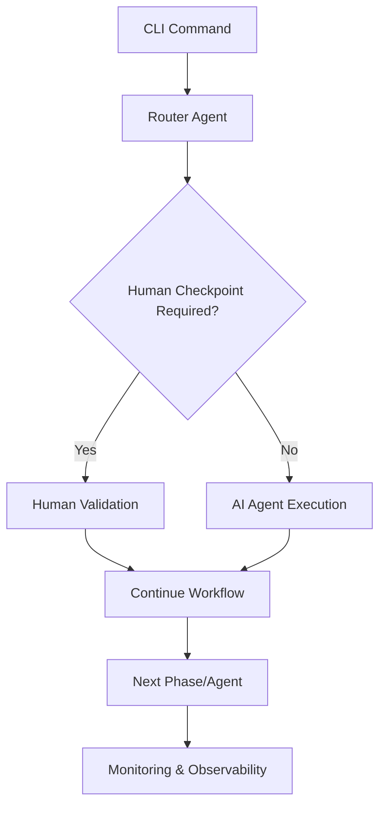
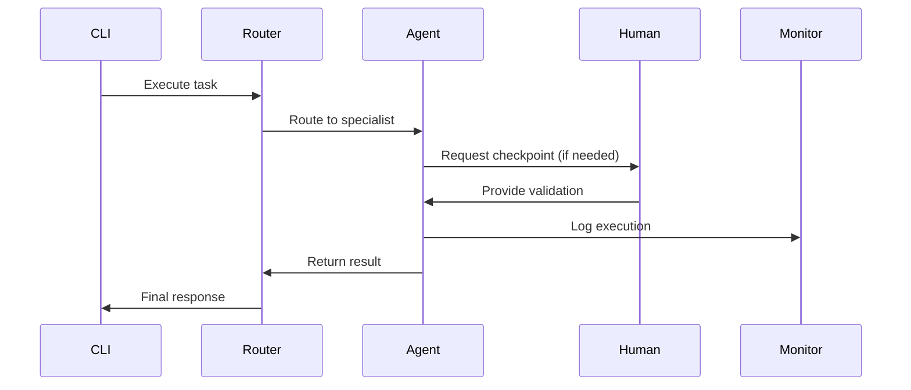

# HUGAI Configuration System

## 🎯 Overview

This directory contains the complete configuration system for **HUGAI (Human-Governed AI)** - a methodology that combines artificial intelligence capabilities with human oversight and governance to create reliable, auditable, and scalable software development processes.

## 📁 Directory Structure

```
config/
├── README.md                 # This file - System architecture and usage guide
├── agents/                   # AI Agent configurations (23 specialized agents)
├── lifecycle/               # Development lifecycle phase configurations  
├── tools/                   # Infrastructure tool configurations
├── llms/                    # LLM model and provider configurations
└── schemas/                 # JSON schemas for validation (future)
```

## 🏗️ System Architecture

### Core Philosophy: Human-Governed AI

The HUGAI system operates on the principle that **AI should augment human decision-making, not replace it**. Every critical decision point includes human checkpoints while leveraging AI for efficiency, analysis, and automation.



### Component Hierarchy

```
HUGAI System
├── 🤖 AI Agents (23)          # Specialized AI workers
│   ├── Router Agent           # Central orchestrator
│   ├── Requirements Analyzer  # Business requirement analysis
│   ├── Architecture Agent     # System design and architecture
│   ├── Implementation Agent   # Code generation and development
│   ├── Security Agent         # Security analysis and compliance
│   └── ... 18 more specialized agents
│
├── 🔄 Lifecycle Phases (10)   # Development workflow stages
│   ├── Planning & Requirements (with gates)
│   ├── Design & Architecture (with checkpoints)
│   ├── Implementation (with validation)
│   ├── Testing & QA (with governance)
│   ├── Deployment (with monitoring)
│   └── Maintenance (with continuous improvement)
│
├── 🛠️ Infrastructure Tools (16) # Supporting infrastructure
│   ├── CI/CD Pipelines        # Automated build and deployment
│   ├── Observability Stack    # Monitoring and tracing
│   ├── Security Scanning      # Vulnerability assessment
│   ├── Test Automation        # Comprehensive testing
│   └── ... 12 more tools
│
└── 🧠 LLM Models              # AI model management
    ├── Multi-provider support (OpenAI, Anthropic, Google, etc.)
    ├── Intelligent routing    # Cost and performance optimization
    ├── Fallback strategies   # Reliability and resilience
    └── Performance monitoring # Quality and efficiency tracking
```

## 🔄 Data Flow and Component Interaction

### 1. Request Processing Flow

```
User Request → Router Agent → Issue Classification → Stakeholder Assignment → Agent Selection → Execution → Human Checkpoint (if required) → Validation → Output
```

### 2. Configuration Consumption

```yaml
# How configurations are consumed by the CLI
hugai command --config-path config/ --agent router --task analyze-requirements

# The system reads:
config/agents/router-agent.yaml     # Router configuration
config/llms/model-llm.yaml         # LLM provider settings  
config/lifecycle/planning.yaml     # Lifecycle phase rules
config/tools/observability.yaml    # Monitoring configuration
```

### 3. Agent Coordination



## 📋 Configuration File Conventions

### Naming Conventions

```
Format: {component-name}-{type}.yaml

Examples:
- router-agent.yaml           # Main router agent configuration
- requirements-analyzer-agent.yaml  # Requirements analysis agent
- planning-requirements.yaml  # Planning phase of lifecycle
- cicd-pipelines.yaml        # CI/CD infrastructure tool
- model-llm.yaml             # LLM model configurations
```

### File Structure Standard

Every configuration file follows this structure:

```yaml
metadata:
  name: "component-name-configuration"
  version: "1.0.0"
  description: "Brief description of component purpose"
  category: "component-type"
  dependencies: []
  tags: []

configuration:
  # Component-specific configuration
  component_philosophy:
    purpose: "Why this component exists"
    principles: []
  
  core_capabilities: {}
  agent_configuration: {}  # For agents only
  
integration:
  # How this component integrates with others
  
validation:
  # Success criteria and validation rules
  
examples:
  # Usage examples and CLI commands
  
cli_usage: |
  # CLI command examples
```

## 🎛️ Configuration Categories

### 1. Agents (`agents/`)

**Purpose**: Define AI agent behaviors, capabilities, and operational parameters.

**Key Components**:
- **Core Capabilities**: What the agent can do
- **Model Selection**: Which LLM models to use for different tasks
- **Human Escalation**: When to involve humans
- **Integration Points**: How to connect with other systems

**Example Usage**:
```bash
hugai agent init security --config agents/security-agent.yaml
hugai agent run requirements-analyzer --input requirements.md
```

### 2. Lifecycle Phases (`lifecycle/`)

**Purpose**: Define development workflow stages, gates, and governance checkpoints.

**Key Components**:
- **Phase Workflows**: Step-by-step processes
- **Quality Gates**: Validation and approval criteria
- **Human Checkpoints**: Required human oversight points
- **Automated Validation**: Automated checks and tests

**Example Usage**:
```bash
hugai lifecycle start planning --project new-feature
hugai lifecycle validate design --phase architecture
```

### 3. Infrastructure Tools (`tools/`)

**Purpose**: Configure supporting tools and infrastructure for the development process.

**Key Components**:
- **Tool Configuration**: Setup and operational parameters
- **Integration Settings**: How tools connect to the system
- **Monitoring**: Health checks and performance metrics
- **Automation**: Automated workflows and triggers

**Example Usage**:
```bash
hugai tools deploy observability --environment production
hugai tools monitor cicd --pipeline main-branch
```

### 4. LLM Models (`llms/`)

**Purpose**: Manage AI model providers, routing, and optimization.

**Key Components**:
- **Provider Configuration**: Multiple LLM providers (OpenAI, Anthropic, etc.)
- **Intelligent Routing**: Cost and performance optimization
- **Fallback Strategies**: Reliability and resilience
- **Cost Management**: Budget controls and optimization

**Example Usage**:
```bash
hugai llm configure --providers openai,anthropic --strategy cost-optimized
hugai llm monitor --costs --performance --real-time
```

## 🔧 Configuration Management

### Environment-Specific Overrides

```yaml
# Base configuration in config/
base_config:
  llm_provider: "openai"
  
# Environment overrides
environments:
  development:
    llm_provider: "local_model"  # Use local models for dev
    human_checkpoints: "minimal" # Fewer checkpoints for speed
    
  production:
    llm_provider: "openai"       # Use reliable cloud models
    human_checkpoints: "strict"  # All checkpoints required
    monitoring: "comprehensive"  # Full monitoring enabled
```

### Configuration Validation

```bash
# Validate individual configuration files
hugai config validate --file agents/router-agent.yaml

# Validate entire configuration system
hugai config validate --all --strict

# Test configuration compatibility
hugai config test --dry-run --environment production
```

## 🚀 Getting Started

### 1. Quick Start

```bash
# Initialize HUGAI system with default configurations
hugai init --config-path config/

# Validate your configuration
hugai config validate --all

# Start a simple workflow
hugai workflow start --type feature-development --config-path config/
```

### 2. Custom Configuration

```bash
# Create custom agent configuration
hugai config create agent --name custom-analyzer --template requirements-analyzer

# Deploy specific tools
hugai tools deploy --tool observability --environment staging

# Configure LLM providers
hugai llm setup --providers openai,anthropic --budget 1000
```

### 3. Integration with Existing Systems

```bash
# Integrate with existing CI/CD
hugai integrate cicd --platform github-actions --config tools/cicd-pipelines.yaml

# Connect to monitoring systems
hugai integrate monitoring --stack prometheus,grafana --config tools/observability-stack.yaml

# Setup version control integration
hugai integrate vcs --platform github --config tools/version-control.yaml
```

## 📊 Monitoring and Observability

### Configuration Health

The system continuously monitors configuration health and provides insights:

```bash
# Check configuration system health
hugai config health

# Get configuration metrics
hugai config metrics --period 24h

# Analyze configuration usage
hugai config analytics --components agents,tools,lifecycle
```

### Performance Monitoring

```yaml
# Configuration performance is tracked via:
monitoring:
  config_load_time: "<100ms"
  validation_time: "<50ms"
  agent_initialization: "<500ms"
  workflow_start_time: "<1s"
```

## 🔄 Configuration Lifecycle

### 1. Development
- Create/modify configuration files
- Validate syntax and semantics
- Test in development environment

### 2. Testing
- Automated validation in CI/CD
- Integration testing with dependencies
- Performance impact assessment

### 3. Deployment
- Environment-specific deployment
- Gradual rollout capabilities
- Rollback mechanisms

### 4. Monitoring
- Runtime configuration monitoring
- Performance impact tracking
- Usage analytics and optimization

## 🤝 Contributing to Configuration

### Adding New Components

1. **Create Configuration File**:
   ```bash
   # Use existing template
   cp agents/template-agent.yaml agents/new-agent.yaml
   ```

2. **Follow Naming Conventions**:
   - Use kebab-case for file names
   - Include component type in name
   - Add version in metadata

3. **Validate Configuration**:
   ```bash
   hugai config validate --file agents/new-agent.yaml
   ```

4. **Update Index** (future):
   ```yaml
   # Add to index.yaml when available
   agents:
     - name: "new-agent"
       file: "agents/new-agent.yaml"
       category: "specialized"
   ```

### Modifying Existing Components

1. **Backup Current Configuration**:
   ```bash
   hugai config backup --component agent-name
   ```

2. **Make Changes**:
   - Maintain backward compatibility
   - Update version in metadata
   - Document changes in description

3. **Test Changes**:
   ```bash
   hugai config test --component agent-name --dry-run
   ```

4. **Deploy Gradually**:
   ```bash
   hugai config deploy --component agent-name --strategy canary
   ```

## 📚 Advanced Usage

### Custom Workflow Creation

```yaml
# Create custom workflow combining multiple components
custom_workflow:
  name: "ai-code-review-workflow"
  components:
    - agent: "security-agent"
    - agent: "performance-agent"  
    - tool: "static-analysis"
    - lifecycle: "testing-qa"
  
  checkpoints:
    - type: "human_validation"
      condition: "security_issues_found"
    - type: "automated_gate"
      condition: "performance_threshold_met"
```

### Multi-Environment Management

```bash
# Deploy to multiple environments
hugai config deploy --environments dev,staging,prod --strategy rolling

# Environment-specific overrides
hugai config override --environment prod --component llm-models --setting "cost_optimization=conservative"
```

### Integration Patterns

```yaml
# Common integration patterns documented in configurations
integration_patterns:
  event_driven:
    description: "Components communicate via events"
    components: ["router-agent", "observability-stack"]
    
  api_gateway:
    description: "Centralized API management"
    components: ["integration-agent", "security-agent"]
    
  microservices:
    description: "Distributed service architecture"
    components: ["all-agents", "containerization", "service-mesh"]
```

## 🆘 Troubleshooting

### Common Issues

1. **Configuration Validation Errors**:
   ```bash
   hugai config validate --verbose --file problematic-config.yaml
   ```

2. **Agent Initialization Failures**:
   ```bash
   hugai agent debug --name failing-agent --logs --verbose
   ```

3. **LLM Provider Connection Issues**:
   ```bash
   hugai llm test-connection --provider openai --debug
   ```

4. **Workflow Execution Problems**:
   ```bash
   hugai workflow debug --workflow-id failed-workflow --trace
   ```

### Performance Optimization

```bash
# Analyze configuration performance
hugai config analyze --performance --recommendations

# Optimize LLM model selection
hugai llm optimize --criteria "cost,latency,quality" --rebalance

# Review agent resource usage
hugai agent analyze --resource-usage --optimization-suggestions
```

## 📖 Documentation Links

- **[CLAUDE.md](../CLAUDE.md)**: Main HUGAI methodology documentation
- **[Agent Configurations](agents/)**: Individual agent documentation
- **[Lifecycle Phases](lifecycle/)**: Development workflow documentation
- **[Infrastructure Tools](tools/)**: Tool-specific documentation
- **[LLM Management](llms/)**: Model management documentation

## 🔄 Version Compatibility

```yaml
compatibility_matrix:
  config_version: "1.0.0"
  cli_version: ">=1.0.0,<2.0.0"
  agent_versions: "1.0.x"
  tool_versions: "1.0.x"
  llm_config_versions: "1.0.x"
```

## 📞 Support and Community

- **Issues**: Report configuration issues in the main repository
- **Discussions**: Join community discussions about HUGAI methodology
- **Contributions**: Follow the contribution guidelines for configuration improvements
- **Documentation**: Help improve documentation for better usability

---

**This configuration system is the foundation of HUGAI's Human-Governed AI methodology. Every component is designed to enhance human decision-making while leveraging AI capabilities for efficiency and scalability.**