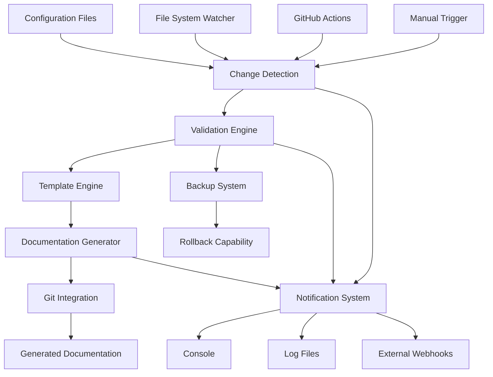

# HUGAI Configuration-Documentation Synchronization System

A comprehensive automation system that maintains bidirectional synchronization between HUGAI configuration files and their corresponding documentation. This ensures that changes in configurations are automatically reflected in documentation, maintaining consistency and reducing manual maintenance overhead.

## 🚀 Features

### Core Synchronization
- **Bidirectional Sync**: Configuration → Documentation and Documentation → Configuration
- **Real-time Monitoring**: File system watcher for instant synchronization
- **Batch Processing**: Efficient handling of multiple file changes
- **Conflict Resolution**: Intelligent handling of synchronization conflicts

### Validation & Quality Assurance
- **Schema Validation**: JSON Schema validation for all configuration files
- **Content Validation**: Ensures generated documentation meets quality standards
- **Link Validation**: Checks for broken internal links in generated documentation
- **Template Validation**: Validates Jinja2 templates before rendering

### Automation & CI/CD
- **GitHub Actions Integration**: Automated sync on push/PR events
- **Git Integration**: Automatic commits with descriptive messages
- **Backup System**: Comprehensive backup and rollback capabilities
- **Notification System**: Multi-channel notifications (console, file, webhooks)

### Advanced Features
- **Template Engine**: Jinja2-based flexible documentation generation
- **Change Detection**: SHA-256 hash-based intelligent change detection
- **Metadata Tracking**: Comprehensive sync history and metadata management
- **Performance Optimization**: Debounced file watching and batch operations

## 📋 System Architecture



## 🛠️ Installation & Setup

### Prerequisites
```bash
# Install Python dependencies
pip install -r config/requirements.txt

# Dependencies include:
# - PyYAML>=6.0
# - jsonschema>=4.17.0
# - Jinja2>=3.1.0
# - watchdog>=3.0.0
```

### Initial Setup
```bash
# Make the script executable
chmod +x config/sync-automation.py

# Create default sync templates
python config/sync-automation.py --setup-templates

# Validate current configurations
python config/validate-config.py

# Perform initial synchronization
python config/sync-automation.py --mode full
```

## 💻 Usage

### Command Line Interface

```bash
# Full synchronization
python config/sync-automation.py --mode full

# Sync specific configuration type
python config/sync-automation.py --mode agents
python config/sync-automation.py --mode lifecycle
python config/sync-automation.py --mode tools
python config/sync-automation.py --mode llms

# Watch for changes and sync automatically
python config/sync-automation.py --watch

# Dry run to preview changes
python config/sync-automation.py --dry-run

# Sync specific file
python config/sync-automation.py --target config/agents/router-agent.yaml

# Setup default templates
python config/sync-automation.py --setup-templates
```

### GitHub Actions Integration

The system automatically triggers on:
- **Push events**: Configuration file changes
- **Pull requests**: Preview documentation changes
- **Schedule**: Daily sync validation
- **Manual dispatch**: On-demand synchronization

```yaml
# Manual trigger example
name: Manual Sync
on:
  workflow_dispatch:
    inputs:
      mode:
        description: 'Sync mode'
        default: 'full'
        type: choice
        options: [full, agents, lifecycle, tools, llms]
```

## 📁 File Structure

```
config/
├── sync-automation.py          # Main synchronization script
├── sync-config.yaml           # Synchronization configuration
├── sync-templates/            # Documentation templates
│   ├── agent-doc-template.md
│   ├── lifecycle-doc-template.md
│   ├── tool-doc-template.md
│   └── llm-doc-template.md
├── schemas/                   # JSON Schemas for validation
├── .sync-metadata.json       # Sync metadata and history
├── sync.log                   # Synchronization logs
└── backups/                   # Backup files
    └── sync/
        ├── backup_20241219_140530/
        └── backup_20241219_140530.zip

.github/workflows/
└── sync-configs-docs.yml     # GitHub Actions workflow
```

## ⚙️ Configuration

### Sync Configuration (`config/sync-config.yaml`)

```yaml
sync_rules:
  config_to_docs:
    agents:
      source_pattern: "config/agents/*.yaml"
      target_pattern: "docs/agents/{name}.md"
      template: "agent-doc-template.md"
    
    lifecycle:
      source_pattern: "config/lifecycle/*.yaml"
      target_pattern: "docs/methodology/{name}.md"
      template: "lifecycle-doc-template.md"

validation:
  enabled: true
  schema_validation: true
  link_validation: true
  content_validation: true

backup:
  enabled: true
  max_backups: 10
  compress: true

git_integration:
  enabled: true
  auto_commit: false  # Set to true for automatic commits
  commit_message_template: "docs: sync configuration changes for {files}"

notifications:
  enabled: true
  channels: ["console", "file"]
  log_file: "sync.log"
```

### Template System

Templates use Jinja2 syntax with access to configuration data:

```jinja2
# {{ config.metadata.name | title }}

{{ config.metadata.description }}

## Overview
**Version:** {{ config.metadata.version }}
**Author:** {{ config.metadata.author }}

## Capabilities

- {{ capability }}


---
*Generated from `{{ config_file }}` on {{ generated_at }}*
```

## 🔍 Validation System

### Configuration Validation
- **JSON Schema**: Validates against type-specific schemas
- **YAML Syntax**: Ensures valid YAML structure
- **Required Fields**: Validates presence of mandatory fields
- **Data Types**: Ensures correct data types and formats

### Documentation Validation
- **Template Rendering**: Validates Jinja2 template syntax
- **Content Quality**: Checks for completeness and structure
- **Link Integrity**: Validates internal links and references
- **Markdown Syntax**: Ensures valid Markdown structure

### Validation Commands
```bash
# Validate all configurations
python config/validate-config.py

# Validate specific file
python config/validate-config.py --file config/agents/router-agent.yaml

# Validate with verbose output
python config/validate-config.py --verbose
```

## 🔄 Change Detection & Sync Process

### Change Detection Algorithm
1. **Hash Calculation**: SHA-256 hash for each configuration file
2. **Comparison**: Compare with stored hashes in metadata
3. **Classification**: Categorize changes (added, modified, deleted)
4. **Prioritization**: Process critical changes first

### Synchronization Flow
1. **Detection**: Identify changed configuration files
2. **Validation**: Validate configurations against schemas
3. **Backup**: Create backup of existing documentation
4. **Generation**: Render new documentation from templates
5. **Integration**: Update documentation files
6. **Verification**: Validate generated documentation
7. **Commit**: Optionally commit changes to Git
8. **Notification**: Send notifications about sync results

## 📊 Monitoring & Logging

### Sync Metadata
```json
{
  "last_sync": "2024-12-19T14:05:30Z",
  "file_hashes": {
    "agents/router-agent.yaml": "a1b2c3d4e5f6...",
    "lifecycle/implementation.yaml": "f6e5d4c3b2a1..."
  },
  "sync_history": [
    {
      "timestamp": "2024-12-19T14:05:30Z",
      "config_file": "config/agents/router-agent.yaml",
      "doc_file": "docs/agents/router-agent.md",
      "action": "sync",
      "success": true
    }
  ],
  "conflicts": [],
  "schema_version": "1.0"
}
```

### Log Analysis
```bash
# View recent sync activity
tail -f config/sync.log

# Search for specific events
grep "ERROR" config/sync.log
grep "router-agent" config/sync.log

# Analyze sync performance
grep "Synchronization complete" config/sync.log | tail -10
```

## 🚨 Troubleshooting

### Common Issues

**Validation Errors**
```bash
# Symptom: Configuration validation fails
# Solution: Check schema compliance
python config/validate-config.py --file path/to/config.yaml
```

**Template Rendering Errors**
```bash
# Symptom: Documentation generation fails
# Solution: Validate template syntax
python -c "from jinja2 import Template; Template(open('template.md').read())"
```

**Git Integration Issues**
```bash
# Symptom: Git commits fail
# Solution: Check git configuration
git config --list
git status
```

**File Permission Issues**
```bash
# Symptom: Cannot write documentation files
# Solution: Check file permissions
ls -la docs/
chmod 755 docs/
```

### Debug Mode
```bash
# Enable verbose logging
export HUGAI_SYNC_DEBUG=1
python config/sync-automation.py --mode full

# Dry run with detailed output
python config/sync-automation.py --dry-run --verbose
```

### Recovery Procedures

**Restore from Backup**
```bash
# List available backups
ls -la config/backups/sync/

# Restore specific backup
cd config/backups/sync/
unzip backup_20241219_140530.zip
cp -r backup_20241219_140530/docs/* ../../docs/
```

**Reset Sync Metadata**
```bash
# Backup current metadata
cp config/.sync-metadata.json config/.sync-metadata.json.backup

# Reset metadata (triggers full resync)
rm config/.sync-metadata.json
python config/sync-automation.py --mode full
```

## 🔧 Advanced Configuration

### Custom Templates
```bash
# Create custom template
mkdir -p config/sync-templates/custom/
cat > config/sync-templates/custom/my-template.md << 'EOF'
# Custom Template for {{ config.metadata.name }}
<!-- Custom template content -->
EOF

# Update sync-config.yaml to use custom template
```

### External Notifications
```python
# Add webhook notifications
notifications:
  enabled: true
  channels: ["console", "file", "webhook"]
  webhook_url: "https://hooks.slack.com/services/..."
  webhook_format: "slack"
```

### Performance Tuning
```yaml
# Optimize for large repositories
performance:
  batch_size: 50
  debounce_time: 5  # seconds
  max_concurrent_syncs: 3
  enable_compression: true
```

## 📈 Metrics & Analytics

### Sync Performance Metrics
- **Sync Duration**: Time taken for full synchronization
- **File Count**: Number of files processed per sync
- **Success Rate**: Percentage of successful synchronizations
- **Error Rate**: Frequency and types of errors

### Usage Analytics
- **Most Frequently Changed**: Configurations changed most often
- **Sync Triggers**: What triggers synchronization most
- **Peak Usage Times**: When synchronization occurs most frequently

### Monitoring Dashboard
```bash
# Generate sync report
python config/sync-automation.py --report --period last-week

# Export metrics
python config/sync-automation.py --export-metrics --format json
```

## 🔮 Future Enhancements

### Planned Features
- [ ] **Real-time Collaboration**: Multi-user simultaneous editing
- [ ] **Conflict Resolution UI**: Web interface for resolving conflicts
- [ ] **Advanced Templates**: Dynamic template selection based on content
- [ ] **Performance Analytics**: Detailed performance monitoring dashboard
- [ ] **Plugin System**: Extensible plugin architecture
- [ ] **Multi-repository Sync**: Synchronization across multiple repositories

### Integration Roadmap
- [ ] **IDE Plugins**: VS Code, IntelliJ extensions
- [ ] **Slack/Teams Integration**: Real-time notifications
- [ ] **JIRA Integration**: Link documentation updates to tickets
- [ ] **Confluence Integration**: Automatic wiki page updates

## 🤝 Contributing

### Development Setup
```bash
# Clone development environment
git clone <repository>
cd hugai-editor

# Install development dependencies
pip install -r config/requirements.txt
pip install -r requirements-dev.txt

# Run tests
python -m pytest config/tests/

# Lint code
flake8 config/sync-automation.py
```

### Testing
```bash
# Unit tests
python -m pytest config/tests/test_sync_automation.py

# Integration tests
python -m pytest config/tests/test_integration.py

# End-to-end tests
python config/tests/e2e_sync_test.py
```

## 📄 License

This synchronization system is part of the HUGAI methodology and follows the same licensing terms as the parent project.

---

**🤖 This system was designed and implemented using the HUGAI methodology itself, demonstrating the power of human-AI collaboration in creating sophisticated automation systems.**