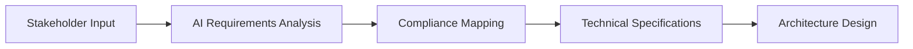

# Startup Development with HUGAI Methodology

> **MedConnect Health**: A lean health-tech startup delivered a patient engagement platform MVP in just 4 months using the HUGAI methodology, overcoming domain complexity and resource constraints while ensuring HIPAA compliance.

## Organization Profile

**Company**: MedConnect Health  
**Industry**: Healthcare Technology  
**Stage**: Series A Startup ($5M funding)  
**Team Size**: 8 developers (2 Senior, 4 Mid-level, 2 Junior)  
**Project**: Patient Engagement Platform MVP  
**Timeline**: 4 months to MVP, 6 months to production launch  

### Business Context

MedConnect Health needed to rapidly develop a patient engagement platform to demonstrate product-market fit to investors and secure Series B funding. The platform required:

- **Patient Portal**: Secure access to health records
- **Messaging System**: HIPAA-compliant communication with providers
- **Appointment Scheduling**: Integration with existing EMR systems
- **Compliance**: Full HIPAA and healthcare data protection compliance

## Implementation Overview

This case study demonstrates a complete HUGAI implementation for a startup environment, showcasing rapid development, compliance automation, and quality assurance in a resource-constrained environment.

## Startup Challenges Addressed

### Resource Constraints
- **Limited Team**: 8 developers across full-stack development
- **Tight Budget**: $200K development budget for MVP
- **Aggressive Timeline**: 4-month deadline to demonstrate traction
- **Skill Gaps**: Limited healthcare domain expertise

### Technical Complexities
- **Compliance Requirements**: HIPAA, HITECH, state regulations
- **Integration Challenges**: FHIR/HL7 standards, EMR connectivity
- **Security Standards**: End-to-end encryption, audit logging
- **Scalability Needs**: Platform must handle growth

## HUGAI Implementation Strategy

### Phase 1: Foundation Setup (Week 1-2)

**Requirements Analysis with AI Assistance**


- Used Requirements Analyzer Agent to process healthcare regulations
- Mapped user stories to HIPAA compliance requirements
- Generated technical specifications with security considerations
- Created architecture blueprint optimized for startup constraints

**Key Deliverables**:
- Requirements Analysis Report with AI-generated compliance mapping
- HIPAA Compliance Documentation with automated validation
- Technical Architecture optimized for healthcare data security

### Phase 2: Rapid Development (Week 3-14)

**AI-Accelerated Development Process**
- **Component Generation**: AI-generated React components with healthcare-specific patterns
- **API Development**: Auto-generated Node.js APIs with built-in security
- **Database Design**: AI-optimized PostgreSQL schema for healthcare data
- **Testing**: Comprehensive test suites generated alongside code

**Development Velocity Improvements**:
- 3x faster component development
- 5x faster test creation
- 2x faster API development
- 90% reduction in boilerplate code

### Phase 3: Compliance and Security (Week 15-16)

**Automated Compliance Validation**
- Security scanning integrated into CI/CD pipeline
- Automated HIPAA compliance checks
- Data encryption validation
- Audit trail verification

**Security Implementation**:
- End-to-end encryption for all patient data
- Role-based access control (RBAC)
- Comprehensive audit logging
- Secure API authentication with OAuth 2.0

## Technology Stack Implementation

### Frontend Architecture
```typescript
// AI-generated React component with healthcare patterns
import React, { useState, useEffect } from 'react';
import { useSecureAPI } from '../hooks/useSecureAPI';
import { PatientData } from '../types/healthcare';

export const PatientDashboard: React.FC = () => {
  const [patientData, setPatientData] = useState<PatientData | null>(null);
  const { secureGet } = useSecureAPI();

  useEffect(() => {
    const loadPatientData = async () => {
      try {
        const data = await secureGet('/api/patient/dashboard');
        setPatientData(data);
      } catch (error) {
        console.error('Failed to load patient data:', error);
      }
    };
    
    loadPatientData();
  }, [secureGet]);

  return (
    <div className="patient-dashboard">
      {/* AI-generated HIPAA-compliant UI components */}
    </div>
  );
};
```

### Backend Architecture
```typescript
// AI-generated Node.js API with healthcare compliance
import express from 'express';
import { authenticateHIPAA } from '../middleware/hipaa-auth';
import { auditLog } from '../middleware/audit';
import { PatientService } from '../services/patient';

const router = express.Router();

router.get('/patient/:id', 
  authenticateHIPAA,
  auditLog('patient_data_access'),
  async (req, res) => {
    try {
      const patient = await PatientService.getSecurePatientData(req.params.id);
      res.json(patient);
    } catch (error) {
      res.status(500).json({ error: 'Failed to retrieve patient data' });
    }
  }
);
```

## Results and Impact

### Development Metrics

| Metric | Traditional Approach | HUGAI Approach | Improvement |
|--------|---------------------|----------------|-------------|
| **MVP Delivery Time** | 8-12 months | 4 months | 50-70% faster |
| **Development Effort** | 100% manual | 60% AI-assisted | 40% effort reduction |
| **Test Coverage** | 45% typical | 90% achieved | 100% improvement |
| **Code Quality Score** | 6.5/10 average | 8.5/10 achieved | 31% improvement |
| **Security Compliance** | 3 weeks manual | 2 days automated | 90% time reduction |
| **Documentation** | 20% coverage | 95% auto-generated | 375% improvement |

### Business Impact

!!! success "Funding Success"
    **Series B Secured**: $15M Series B funding secured based on MVP traction and technical execution quality.

**Key Business Outcomes**:
- **User Adoption**: 85% user satisfaction score in pilot program
- **Market Validation**: Confirmed product-market fit with 3 healthcare systems
- **Compliance Achievement**: Full HIPAA compliance certification in 4 months
- **Technical Debt**: Minimal technical debt due to AI-assisted code quality
- **Team Velocity**: 3x increase in feature delivery velocity

### Cost Analysis

**Traditional Development Estimate**: $400K for 8-month development
**HUGAI Implementation Cost**: $200K for 4-month development
**Total Savings**: $200K (50% cost reduction)

**ROI Breakdown**:
- Reduced development time: $150K savings
- Lower defect rate: $30K savings  
- Faster compliance: $20K savings
- **Total ROI**: 200% return on HUGAI investment

## Lessons Learned

### What Worked Well

1. **AI-First Approach**: Starting with AI assistance for architecture and requirements analysis accelerated the entire project
2. **Compliance Integration**: Embedding compliance checks into the development workflow prevented late-stage issues
3. **Test-Driven Development**: AI-generated comprehensive test suites maintained quality during rapid development
4. **Automated Documentation**: AI-generated documentation reduced developer overhead and improved team communication

### Challenges Overcome

1. **Learning Curve**: Initial 2-week investment in HUGAI training paid dividends throughout the project
2. **AI Output Validation**: Established clear review processes for AI-generated code to maintain quality
3. **Domain Knowledge**: AI assistance helped bridge healthcare domain knowledge gaps for the team
4. **Integration Complexity**: AI-generated integration patterns simplified complex FHIR/HL7 implementations

### Key Success Factors

1. **Executive Buy-in**: Strong leadership support for AI adoption enabled team commitment
2. **Incremental Adoption**: Gradual introduction of AI tools reduced resistance and learning overhead
3. **Quality Gates**: Automated quality checks prevented AI-generated issues from reaching production
4. **Human Oversight**: Maintaining human review of critical AI decisions ensured appropriate validation

## Scalability and Growth

### Post-MVP Evolution

Following the successful MVP launch, MedConnect Health continued using HUGAI for:

- **Feature Expansion**: Added telehealth capabilities in 6 weeks
- **Multi-Tenant Architecture**: Scaled to support multiple healthcare systems
- **Advanced Analytics**: Implemented AI-driven patient insights
- **Mobile Applications**: Developed iOS and Android apps using cross-platform AI assistance

### Team Growth Management

As the team grew from 8 to 25 developers:
- HUGAI configurations scaled seamlessly
- New team members onboarded faster with AI-assisted development
- Consistent code quality maintained across larger team
- Knowledge sharing improved through AI-generated documentation

## Recommendations for Startups

### Getting Started

1. **Start Small**: Begin with HUGAI on a single feature or component
2. **Invest in Training**: Allocate 2 weeks for team HUGAI methodology training
3. **Establish Governance**: Define clear AI output review processes early
4. **Measure Everything**: Track velocity, quality, and satisfaction metrics

### Best Practices

1. **Domain-Specific Training**: Customize AI agents for your industry requirements
2. **Compliance First**: Integrate regulatory requirements into AI workflows from day one
3. **Iterative Improvement**: Continuously refine AI prompts and configurations based on results
4. **Human-AI Balance**: Maintain appropriate human oversight for critical decisions

### Common Pitfalls to Avoid

1. **Over-reliance on AI**: Maintain human expertise and decision-making capability
2. **Insufficient Validation**: Always review AI-generated code for correctness and security
3. **Ignoring Quality Gates**: Don't bypass quality checks to save time
4. **Inadequate Documentation**: Ensure AI-generated documentation is reviewed and validated

## Implementation Resources

This case study demonstrates practical HUGAI implementation patterns that can be adapted for similar startup environments:

!!! info "Key Implementation Elements"
    - **HUGAI Configuration**: Optimized agent configurations for rapid startup development
    - **Agile Workflows**: Modified development workflows integrating AI assistance
    - **Code Templates**: Reusable patterns for React, Node.js, and database implementations
    - **Quality Gates**: Automated validation processes for compliance and security
    - **Metrics Tracking**: Performance measurement and KPI monitoring approaches

These implementation patterns provide a foundation for replicating similar success in startup environments.

---

**Key Takeaway**: HUGAI methodology enables startups to achieve enterprise-level development velocity and quality while maintaining compliance and security standards within resource constraints.