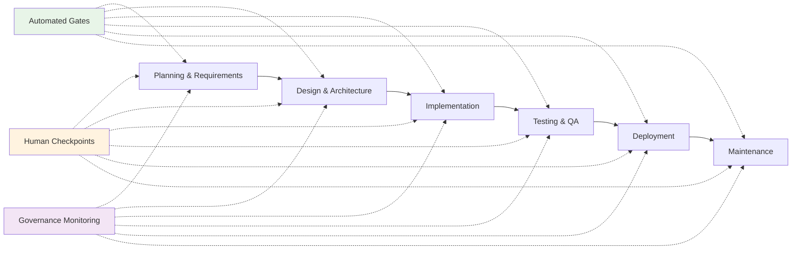

# Lifecycle Phase Customization Guide

## Overview

This guide provides comprehensive instructions for customizing HUGAI lifecycle phases to meet specific organizational needs, regulatory requirements, and project contexts. Learn how to modify existing phases, create custom phases, and integrate them seamlessly into your development workflow.

## Understanding Lifecycle Architecture

### Core Lifecycle Framework



### Customization Levels

| Customization Level | Scope | Complexity | Use Cases |
|-------------------|-------|------------|-----------|
| **Configuration Tuning** | Parameters and thresholds | Low | Industry-specific requirements |
| **Process Enhancement** | Add/modify activities | Medium | Compliance frameworks |
| **Phase Extension** | New sub-phases | Medium-High | Specialized workflows |
| **Custom Phases** | Entirely new phases | High | Unique business processes |

## Prerequisites

### Required Knowledge
- **HUGAI Methodology**: Understanding of core principles and existing phases
- **YAML Configuration**: Advanced YAML syntax and templating
- **Process Design**: Workflow modeling and optimization
- **Compliance Frameworks**: Relevant regulatory requirements

### Development Environment
```bash
# Set up lifecycle customization environment
hugai lifecycle init --custom-development
cd lifecycle-customization

# Install required tools
pip install hugai-lifecycle-toolkit
npm install -g @hugai/lifecycle-validator
```

## Configuration-Level Customization

### 1. Parameter Tuning

Modify existing phase parameters to match your requirements:

```yaml
# Example: Enhanced security requirements
lifecycle_customization:
  phase: "testing-quality-assurance"
  
  parameter_overrides:
    security_testing:
      vulnerability_scan_threshold: "zero_critical_one_high"  # Stricter than default
      penetration_testing: "required"  # Default: conditional
      compliance_frameworks: ["SOC2", "GDPR", "HIPAA"]  # Industry-specific
      
    performance_testing:
      load_test_duration: "60_minutes"  # Extended from 30 minutes
      stress_test_multiplier: 3.0  # Increased from 2.0
      memory_leak_detection: "enabled"  # Additional requirement
      
    code_quality:
      test_coverage_threshold: 95  # Increased from 80
      complexity_threshold: 8  # Reduced from 10
      documentation_coverage: 90  # New requirement
```

### 2. Gate Threshold Adjustment

Customize quality gates for specific organizational standards:

```yaml
quality_gates_customization:
  implementation_phase:
    code_review_gates:
      mandatory_reviewers: 2  # Increased from 1
      security_review_required: true  # For all changes
      architecture_review_threshold: "component_boundary_changes"
      
    automated_checks:
      static_analysis:
        blocker_severity: "major"  # Stricter than default "critical"
        technical_debt_ratio: 5  # Maximum 5% debt
        
      dependency_checks:
        vulnerability_age_threshold: "30_days"  # Must fix within 30 days
        license_compliance: "strict"  # No GPL in commercial products
        
  deployment_phase:
    release_gates:
      canary_deployment: "mandatory"  # Always use canary
      monitoring_validation: "24_hours"  # Extended validation period
      rollback_criteria: "any_error_rate_increase"  # Conservative approach
```

## Process Enhancement

### 3. Adding Compliance Activities

Integrate specific compliance requirements into existing phases:

```yaml
compliance_enhancement:
  gdpr_compliance_integration:
    target_phases: ["planning-requirements", "design-architecture", "implementation"]
    
    planning_phase_additions:
      activities:
        - name: "data_protection_impact_assessment"
          trigger: "personal_data_processing_identified"
          owner: "data_protection_officer"
          deliverables: ["dpia_report", "privacy_requirements"]
          
        - name: "lawful_basis_determination"
          trigger: "data_collection_requirements_defined"
          owner: "legal_team"
          deliverables: ["lawful_basis_documentation"]
          
    design_phase_additions:
      activities:
        - name: "privacy_by_design_review"
          trigger: "system_architecture_draft_complete"
          owner: "privacy_engineer"
          deliverables: ["privacy_design_patterns", "data_minimization_strategy"]
          
        - name: "cross_border_transfer_analysis"
          trigger: "international_deployment_planned"
          owner: "compliance_team"
          deliverables: ["adequacy_decision_verification", "transfer_safeguards"]
          
    implementation_phase_additions:
      activities:
        - name: "consent_mechanism_implementation"
          trigger: "user_interface_development"
          owner: "frontend_team"
          deliverables: ["consent_ui_implementation", "consent_withdrawal_mechanism"]
```

### 4. Industry-Specific Workflows

Create specialized workflows for specific industries:

```yaml
healthcare_workflow_customization:
  hipaa_compliance_workflow:
    applicable_when: "healthcare_data_involved"
    
    additional_phases:
      hipaa_risk_assessment:
        position: "after_design_before_implementation"
        duration: "3-5_days"
        
        activities:
          - name: "phi_identification_and_classification"
            owner: "privacy_officer"
            tools: ["data_discovery_tool", "classification_engine"]
            
          - name: "minimum_necessary_analysis"
            owner: "healthcare_analyst"
            deliverables: ["data_minimization_plan"]
            
          - name: "access_control_design"
            owner: "security_architect"
            deliverables: ["rbac_specification", "audit_logging_design"]
            
        gates:
          - name: "hipaa_compliance_gate"
            type: "human_checkpoint"
            required_approvers: ["hipaa_security_officer", "compliance_manager"]
            criteria: ["phi_adequately_protected", "minimum_necessary_implemented"]
            
      hipaa_validation:
        position: "after_testing_before_deployment"
        duration: "2-3_days"
        
        activities:
          - name: "penetration_testing_phi_focused"
            owner: "security_team"
            scope: "phi_access_paths"
            
          - name: "audit_log_validation"
            owner: "compliance_team"
            validation: "comprehensive_audit_trail"
```

## Custom Phase Creation

### 5. Creating Entirely New Phases

Design and implement custom phases for unique organizational needs:

```yaml
custom_phase_example:
  ai_ethics_review_phase:
    metadata:
      name: "ai-ethics-review"
      version: "1.0.0"
      description: "Comprehensive AI ethics and bias assessment phase"
      category: "governance-phase"
      position: "after_implementation_before_testing"
      duration: "5-10_business_days"
      
    trigger_conditions:
      - "ai_ml_components_present"
      - "algorithmic_decision_making_involved"
      - "user_facing_ai_features"
      
    phase_objectives:
      - "identify_potential_bias_sources"
      - "assess_fairness_across_user_groups"
      - "validate_explainability_requirements"
      - "ensure_ethical_ai_compliance"
      
    activities:
      bias_assessment:
        name: "Algorithmic Bias Assessment"
        owner: "ai_ethics_team"
        duration: "3_days"
        
        inputs:
          - "trained_model_artifacts"
          - "training_data_samples"
          - "feature_engineering_documentation"
          - "target_user_demographics"
          
        process:
          1. "demographic_parity_analysis"
          2. "equalized_odds_testing"
          3. "individual_fairness_validation"
          4. "intersectional_bias_examination"
          
        outputs:
          - "bias_assessment_report"
          - "fairness_metrics_dashboard"
          - "bias_mitigation_recommendations"
          
        tools:
          - "fairness_testing_framework"
          - "bias_detection_algorithms"
          - "demographic_analysis_tools"
          
      explainability_validation:
        name: "AI Explainability Validation"
        owner: "ml_engineering_team"
        duration: "2_days"
        
        requirements:
          - "model_interpretability_mechanisms"
          - "user_friendly_explanations"
          - "regulatory_explanation_compliance"
          
        deliverables:
          - "explainability_implementation"
          - "explanation_quality_metrics"
          - "user_comprehension_validation"
          
      ethical_impact_assessment:
        name: "Ethical Impact Assessment"
        owner: "ethics_committee"
        duration: "2_days"
        
        evaluation_criteria:
          - "human_autonomy_preservation"
          - "transparency_and_accountability"
          - "privacy_and_data_rights"
          - "societal_benefit_analysis"
          
        stakeholder_review:
          required_participants:
            - "ethics_officer"
            - "user_representative"
            - "domain_expert"
            - "legal_counsel"
            
    gates:
      automated_gates:
        - name: "bias_threshold_gate"
          type: "automated"
          criteria: "demographic_parity_difference < 0.1"
          blocking: true
          
        - name: "explainability_coverage_gate"
          type: "automated"
          criteria: "explanation_coverage > 90%"
          blocking: true
          
      human_checkpoints:
        - name: "ethics_committee_approval"
          type: "human_checkpoint"
          required_approvers: ["chief_ethics_officer"]
          criteria:
            - "ethical_guidelines_compliance"
            - "bias_mitigation_adequate"
            - "explainability_satisfactory"
            - "stakeholder_concerns_addressed"
          
          approval_options:
            - "approve_unconditionally"
            - "approve_with_monitoring"
            - "approve_with_modifications"
            - "reject_for_major_revision"
            
    escalation_procedures:
      bias_detection:
        trigger: "significant_bias_detected"
        escalation_path: ["ai_ethics_team", "chief_ethics_officer", "executive_committee"]
        timeline: "immediate_for_critical_bias"
        
      stakeholder_disagreement:
        trigger: "ethics_committee_cannot_reach_consensus"
        resolution: "executive_ethics_panel_review"
        timeline: "within_48_hours"
        
    monitoring_and_metrics:
      phase_metrics:
        - "time_to_complete_bias_assessment"
        - "number_of_bias_issues_identified"
        - "percentage_of_bias_issues_resolved"
        - "stakeholder_satisfaction_score"
        
      quality_indicators:
        - "false_positive_rate_in_bias_detection"
        - "explanation_quality_user_rating"
        - "ethics_review_thoroughness_score"
```

### 6. Integration Configuration

Configure how custom phases integrate with existing workflow:

```yaml
integration_configuration:
  workflow_integration:
    ai_ethics_review_integration:
      predecessor_phase: "implementation"
      successor_phase: "testing-quality-assurance"
      
      handoff_artifacts:
        from_implementation:
          - "model_artifacts"
          - "training_documentation"
          - "feature_specifications"
          
        to_testing:
          - "ethics_approval_certificate"
          - "bias_mitigation_implementation"
          - "explainability_mechanisms"
          
      conditional_execution:
        required_conditions:
          - "project_type == 'ai_ml_project'"
          - "user_impact_level >= 'medium'"
          
        skip_conditions:
          - "prototype_or_research_only"
          - "internal_tools_with_no_user_impact"
          
  agent_collaboration:
    involved_agents:
      - agent: "ai_ethics_agent"
        role: "primary_reviewer"
        responsibilities: ["bias_assessment", "fairness_validation"]
        
      - agent: "compliance_agent"
        role: "regulatory_validator"
        responsibilities: ["legal_compliance", "regulatory_alignment"]
        
      - agent: "security_agent"
        role: "privacy_validator"
        responsibilities: ["data_privacy", "security_implications"]
        
    collaboration_patterns:
      parallel_review:
        agents: ["ai_ethics_agent", "compliance_agent"]
        coordination: "shared_workspace"
        
      sequential_validation:
        sequence: ["ai_ethics_agent", "security_agent", "compliance_agent"]
        handoff_criteria: "previous_agent_approval"
```

## Advanced Customization Techniques

### 7. Dynamic Phase Configuration

Create adaptive phases that modify behavior based on project characteristics:

```yaml
dynamic_phase_configuration:
  adaptive_testing_phase:
    base_configuration: "testing-quality-assurance"
    
    adaptation_rules:
      project_criticality_high:
        conditions:
          - "project_criticality == 'mission_critical'"
          - "user_base_size > 100000"
          
        modifications:
          test_coverage_requirement: 98  # Increased from 80
          performance_testing: "extended_duration"
          security_testing: "comprehensive_penetration"
          chaos_engineering: "mandatory"
          
      fintech_regulations:
        conditions:
          - "industry == 'financial_services'"
          - "handles_financial_transactions == true"
          
        additional_activities:
          - "pci_dss_compliance_validation"
          - "financial_regulation_testing"
          - "anti_money_laundering_checks"
          
        modified_gates:
          security_gate:
            additional_criteria: ["pci_compliance_verified"]
            additional_approvers: ["financial_compliance_officer"]
            
      startup_agile_mode:
        conditions:
          - "organization_size < 50"
          - "development_methodology == 'agile'"
          
        simplifications:
          documentation_requirements: "reduced"
          approval_processes: "streamlined"
          parallel_activities: "increased"
```

### 8. Cross-Phase Dependencies

Manage complex dependencies between customized phases:

```yaml
cross_phase_dependencies:
  dependency_management:
    data_governance_workflow:
      phases_involved: ["planning", "design", "implementation", "testing"]
      
      shared_artifacts:
        data_classification_schema:
          created_in: "planning"
          modified_in: ["design", "implementation"]
          validated_in: "testing"
          
        privacy_requirements:
          created_in: "planning"
          implemented_in: "design"
          validated_in: "implementation"
          tested_in: "testing"
          
      dependency_rules:
        - rule: "data_classification_must_be_complete_before_design"
          enforcement: "blocking_gate"
          
        - rule: "privacy_implementation_must_match_requirements"
          validation: "automated_compliance_check"
          
        - rule: "testing_must_validate_all_privacy_controls"
          criteria: "100_percent_privacy_test_coverage"
          
    security_workflow:
      threat_modeling:
        initial_phase: "design"
        update_phases: ["implementation", "testing"]
        validation_phase: "deployment"
        
      security_controls:
        design_phase: "specify_security_requirements"
        implementation_phase: "implement_security_controls"
        testing_phase: "validate_security_effectiveness"
        deployment_phase: "configure_production_security"
```

## Testing and Validation

### 9. Custom Phase Testing

Comprehensive testing strategy for customized phases:

```yaml
testing_strategy:
  unit_testing:
    phase_logic_tests:
      - test: "activity_execution_order"
        validation: "dependencies_respected"
        
      - test: "gate_evaluation_logic"
        scenarios: ["pass", "fail", "conditional"]
        
      - test: "artifact_handoff_validation"
        validation: "required_artifacts_present"
        
  integration_testing:
    workflow_integration:
      - test: "custom_phase_in_complete_workflow"
        scenario: "end_to_end_project_execution"
        validation: "seamless_phase_transitions"
        
      - test: "agent_collaboration_in_custom_phase"
        agents: ["all_involved_agents"]
        validation: "effective_collaboration"
        
    conditional_execution:
      - test: "phase_skip_conditions"
        scenarios: ["should_execute", "should_skip"]
        validation: "correct_execution_decisions"
        
  performance_testing:
    phase_duration:
      - metric: "phase_completion_time"
        target: "within_specified_duration"
        load: "realistic_project_complexity"
        
    resource_utilization:
      - metric: "cpu_memory_usage"
        validation: "efficient_resource_usage"
        
  user_acceptance_testing:
    stakeholder_validation:
      participants: ["phase_owners", "quality_assurance", "end_users"]
      scenarios: ["typical_usage", "edge_cases", "error_conditions"]
      success_criteria: ["usability", "effectiveness", "compliance"]
```

### 10. Validation and Compliance

Ensure custom phases meet organizational and regulatory requirements:

```yaml
validation_framework:
  compliance_validation:
    regulatory_alignment:
      - framework: "ISO_27001"
        validation: "security_controls_adequately_addressed"
        
      - framework: "GDPR"
        validation: "privacy_requirements_implemented"
        
      - framework: "SOX"
        validation: "financial_controls_present"
        
    organizational_policies:
      - policy: "code_review_standards"
        validation: "review_requirements_met"
        
      - policy: "testing_standards"
        validation: "quality_thresholds_achieved"
        
  quality_assurance:
    phase_effectiveness:
      metrics:
        - "defect_detection_rate"
        - "time_to_resolution"
        - "stakeholder_satisfaction"
        
    process_improvement:
      feedback_collection:
        sources: ["phase_participants", "downstream_phases", "end_users"]
        frequency: "after_each_phase_execution"
        
      continuous_improvement:
        review_cycle: "monthly"
        improvement_implementation: "quarterly"
```

## Deployment and Operations

### 11. Rollout Strategy

Systematic approach to deploying customized phases:

```yaml
deployment_strategy:
  pilot_deployment:
    scope: "single_low_risk_project"
    duration: "one_complete_project_cycle"
    success_criteria:
      - "phase_executes_without_blocking_issues"
      - "stakeholder_feedback_positive"
      - "compliance_requirements_met"
      
  staged_rollout:
    stage_1:
      scope: "non_critical_projects"
      percentage: "20%_of_projects"
      duration: "2_months"
      
    stage_2:
      scope: "medium_criticality_projects"
      percentage: "60%_of_projects"
      duration: "3_months"
      
    stage_3:
      scope: "all_projects"
      percentage: "100%_of_projects"
      duration: "ongoing"
      
  rollback_procedures:
    triggers:
      - "phase_blocking_project_delivery"
      - "compliance_violations_detected"
      - "stakeholder_satisfaction_below_threshold"
      
    rollback_actions:
      - "revert_to_previous_phase_configuration"
      - "implement_immediate_fixes"
      - "conduct_post_incident_review"
```

### 12. Monitoring and Optimization

Continuous monitoring and improvement of custom phases:

```yaml
monitoring_framework:
  performance_metrics:
    efficiency_metrics:
      - "phase_duration_vs_planned"
      - "resource_utilization_efficiency"
      - "automation_vs_manual_effort_ratio"
      
    quality_metrics:
      - "defect_escape_rate"
      - "rework_percentage"
      - "compliance_adherence_rate"
      
    satisfaction_metrics:
      - "stakeholder_satisfaction_scores"
      - "phase_participant_feedback"
      - "downstream_phase_satisfaction"
      
  continuous_improvement:
    optimization_areas:
      - "activity_automation_opportunities"
      - "gate_threshold_optimization"
      - "tool_integration_improvements"
      - "process_streamlining_opportunities"
      
    improvement_process:
      data_collection: "automated_metrics_plus_surveys"
      analysis_frequency: "monthly"
      improvement_implementation: "quarterly"
      
  alerts_and_notifications:
    performance_alerts:
      - alert: "phase_duration_exceeded"
        threshold: "20%_over_planned_duration"
        action: "investigate_and_optimize"
        
    quality_alerts:
      - alert: "compliance_violation_detected"
        severity: "critical"
        action: "immediate_investigation"
        
    satisfaction_alerts:
      - alert: "stakeholder_satisfaction_declining"
        threshold: "below_4_0_out_of_5"
        action: "stakeholder_feedback_session"
```

## Best Practices and Guidelines

### Configuration Management

```yaml
best_practices:
  version_control:
    - "maintain_phase_configurations_in_git"
    - "use_semantic_versioning_for_phase_changes"
    - "implement_peer_review_for_configuration_changes"
    - "maintain_rollback_compatible_versions"
    
  documentation:
    - "document_customization_rationale"
    - "maintain_phase_usage_guidelines"
    - "provide_troubleshooting_documentation"
    - "create_training_materials_for_stakeholders"
    
  testing:
    - "test_custom_phases_in_isolation"
    - "validate_workflow_integration_thoroughly"
    - "conduct_user_acceptance_testing"
    - "perform_compliance_validation"
    
  deployment:
    - "use_gradual_rollout_strategies"
    - "monitor_performance_closely"
    - "gather_stakeholder_feedback_continuously"
    - "maintain_rollback_capabilities"
```

### Common Pitfalls to Avoid

```yaml
common_pitfalls:
  over_customization:
    problem: "adding_unnecessary_complexity"
    solution: "start_simple_and_iterate"
    
  inadequate_testing:
    problem: "insufficient_validation_before_deployment"
    solution: "comprehensive_testing_strategy"
    
  poor_change_management:
    problem: "inadequate_stakeholder_communication"
    solution: "structured_change_management_process"
    
  compliance_gaps:
    problem: "missing_regulatory_requirements"
    solution: "thorough_compliance_analysis"
    
  performance_issues:
    problem: "phases_taking_longer_than_expected"
    solution: "performance_monitoring_and_optimization"
```

---

This comprehensive lifecycle customization guide provides the knowledge and tools needed to tailor HUGAI development phases to your organization's specific needs while maintaining quality, compliance, and efficiency.