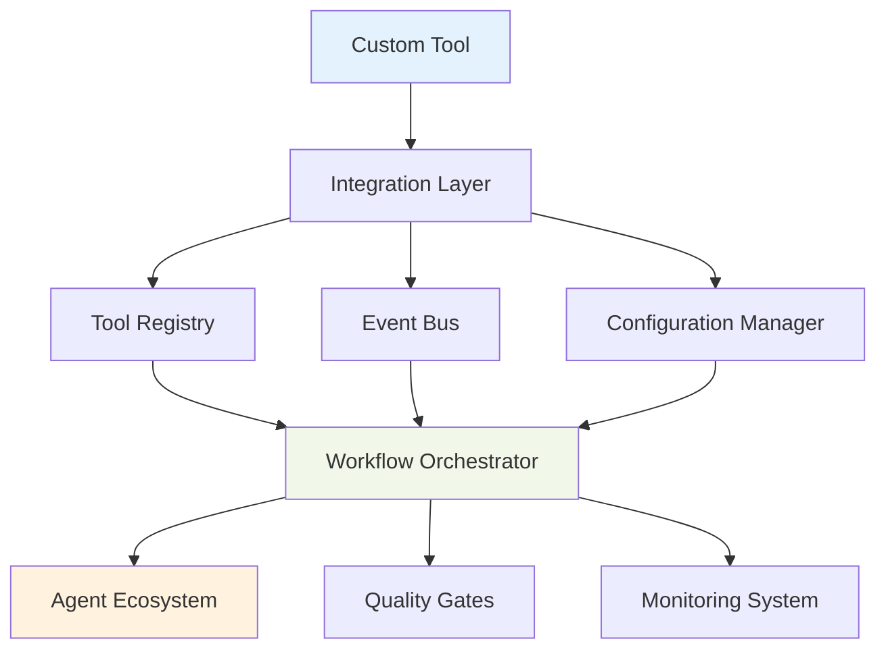

# Tool Integration and Customization Guide

## Overview

This comprehensive guide covers integrating custom tools into the HUGAI ecosystem, from simple API integrations to complex workflow orchestrations. Whether you're connecting existing enterprise tools or building new specialized capabilities, this guide provides practical implementation strategies and best practices.

## Integration Architecture

### HUGAI Tool Integration Framework



### Integration Types

| Integration Type | Use Cases | Complexity | Time to Implement |
|------------------|-----------|------------|-------------------|
| **API Integration** | REST/GraphQL services | Low | 1-2 weeks |
| **CLI Integration** | Command-line tools | Low-Medium | 1-3 weeks |
| **Webhook Integration** | Event-driven tools | Medium | 2-4 weeks |
| **Message Queue** | Asynchronous processing | Medium-High | 3-6 weeks |
| **Custom Plugin** | Complex business logic | High | 4-8 weeks |

## Prerequisites and Setup

### Development Environment

```bash
# Install HUGAI development tools
npm install -g @hugai/cli
pip install hugai-toolkit

# Clone tool integration template
hugai create tool-integration --template custom-tool

# Set up development environment
cd custom-tool-integration
hugai setup --dev-mode
```

### Required Knowledge

- **API Design**: REST/GraphQL, authentication, rate limiting
- **Event Systems**: Webhooks, message queues, event sourcing
- **Configuration Management**: YAML, environment variables, secrets
- **Testing**: Unit, integration, and end-to-end testing
- **Monitoring**: Logging, metrics, alerting

## Step-by-Step Integration Guide

### Step 1: Tool Analysis and Planning

#### 1.1 Capability Assessment

Analyze your tool's capabilities and integration requirements:

```yaml
tool_analysis:
  tool_name: "Advanced Security Scanner"
  vendor: "SecurityCorp"
  version: "v2.1"
  
  capabilities:
    primary:
      - "static_code_analysis"
      - "dependency_vulnerability_scanning"
      - "license_compliance_checking"
    secondary:
      - "custom_rule_creation"
      - "report_generation"
      - "integration_apis"
      
  technical_specifications:
    api_type: "REST API v3"
    authentication: "OAuth 2.0 + API Key"
    rate_limits: "1000 requests/hour"
    data_formats: ["JSON", "XML", "SARIF"]
    
  integration_requirements:
    network_access: "outbound HTTPS only"
    data_sensitivity: "high - source code analysis"
    compliance: ["SOC2", "ISO27001"]
    availability: "99.9% SLA required"
```

#### 1.2 Integration Architecture Design

```yaml
integration_architecture:
  integration_pattern: "API + Webhook"
  
  data_flow:
    inbound:
      - source: "CI/CD Pipeline"
        trigger: "code_commit"
        data: "repository_metadata"
        
      - source: "Security Agent"
        trigger: "security_scan_request"
        data: "scan_configuration"
        
    outbound:
      - destination: "Security Agent"
        event: "scan_complete"
        data: "vulnerability_report"
        
      - destination: "Compliance Agent"
        event: "compliance_check_complete"
        data: "license_analysis"
        
  error_handling:
    retry_strategy: "exponential_backoff"
    circuit_breaker: "enabled"
    fallback_behavior: "queue_for_manual_review"
```

### Step 2: Configuration File Creation

#### 2.1 Base Tool Configuration

Create the tool configuration using the template:

```bash
# Generate from template
hugai config generate --type tool --name advanced-security-scanner

# Edit generated configuration
vim config/tools/advanced-security-scanner.yaml
```

#### 2.2 Complete Tool Metadata

```yaml
metadata:
  name: "advanced-security-scanner"
  version: "1.0.0"
  description: "Enterprise security scanning with vulnerability detection and compliance checking"
  category: "security-tools"
  vendor: "SecurityCorp"
  license: "Commercial"
  
  author: "Security Team"
  created: "2024-12-19"
  updated: "2024-12-19"
  tags:
    - "security"
    - "vulnerability-scanning"
    - "compliance"
    - "static-analysis"
    
  documentation:
    primary_doc: "docs/tools/advanced-security-scanner.md"
    vendor_docs: "https://securitycorp.com/docs/api"
    integration_guide: "docs/guides/security-scanner-integration.md"
    
  maintainer: "security-team@company.com"
  status: "active"
  review_date: "2025-06-19"
```

#### 2.3 Core Configuration

```yaml
configuration:
  tool_type: "security_analysis"
  deployment_model: "saas"
  
  capabilities:
    scanning:
      - "sast" # Static Application Security Testing
      - "dependency_analysis"
      - "license_scanning"
      - "secret_detection"
      - "iac_security" # Infrastructure as Code
      
    reporting:
      - "vulnerability_reports"
      - "compliance_dashboards"
      - "trend_analysis"
      - "executive_summaries"
      
    integration:
      - "ci_cd_integration"
      - "ide_plugins"
      - "webhook_notifications"
      - "api_access"
      
  supported_languages:
    - "javascript"
    - "typescript"
    - "python"
    - "java"
    - "go"
    - "rust"
    - "docker"
    - "kubernetes"
    
  connection:
    base_url: "${SECURITY_SCANNER_BASE_URL}"
    api_version: "v3"
    timeout: 300
    retry_attempts: 3
    
  authentication:
    type: "oauth2_with_api_key"
    oauth_endpoint: "${SECURITY_SCANNER_OAUTH_URL}"
    client_id: "${SECURITY_SCANNER_CLIENT_ID}"
    client_secret: "${SECURITY_SCANNER_CLIENT_SECRET}"
    api_key: "${SECURITY_SCANNER_API_KEY}"
    token_refresh_threshold: 300 # 5 minutes before expiry
    
  rate_limiting:
    requests_per_hour: 1000
    concurrent_scans: 5
    backoff_strategy: "exponential"
    respect_server_limits: true
```

### Step 3: Integration Implementation

#### 3.1 API Integration Layer

```yaml
integration:
  api_endpoints:
    scan_initiation:
      path: "/api/v3/scans"
      method: "POST"
      purpose: "Initiate security scan"
      request_format: |
        {
          "project_id": "string",
          "repository_url": "string",
          "branch": "string",
          "scan_types": ["sast", "dependency"],
          "configuration": {
            "severity_threshold": "medium",
            "exclude_paths": ["test/", "docs/"]
          }
        }
      response_format: |
        {
          "scan_id": "string",
          "status": "initiated",
          "estimated_completion": "ISO8601",
          "webhook_url": "string"
        }
        
    scan_status:
      path: "/api/v3/scans/{scan_id}"
      method: "GET"
      purpose: "Check scan progress"
      
    scan_results:
      path: "/api/v3/scans/{scan_id}/results"
      method: "GET"
      purpose: "Retrieve scan results"
      formats: ["json", "sarif", "pdf"]
      
    cancel_scan:
      path: "/api/v3/scans/{scan_id}"
      method: "DELETE"
      purpose: "Cancel running scan"
      
  webhook_endpoints:
    scan_completed:
      path: "/hugai/webhooks/security-scanner/scan-complete"
      events: ["scan.completed", "scan.failed", "scan.cancelled"]
      authentication: "hmac_sha256"
      secret: "${WEBHOOK_SECRET}"
      
  triggers:
    - event: "code_commit"
      condition: "security_scan_required"
      action: "initiate_security_scan"
      priority: "high"
      
    - event: "pull_request_opened"
      condition: "contains_security_sensitive_changes"
      action: "comprehensive_security_analysis"
      priority: "urgent"
      
    - event: "scheduled_scan"
      condition: "weekly_compliance_scan"
      action: "full_project_scan"
      priority: "medium"
```

#### 3.2 Data Processing and Transformation

```yaml
  data_processing:
    input_transformation:
      hugai_to_scanner:
        project_metadata: |
          {
            "project_id": "{{ project.id }}",
            "repository_url": "{{ project.repository.url }}",
            "branch": "{{ scan_request.branch | default('main') }}",
            "scan_types": {{ scan_request.types | to_json }},
            "configuration": {
              "severity_threshold": "{{ scan_request.severity | default('medium') }}",
              "exclude_paths": {{ project.exclusions | default([]) | to_json }}
            }
          }
          
    output_transformation:
      scanner_to_hugai:
        vulnerability_report: |
          {
            "scan_id": "{{ scan.id }}",
            "project": "{{ scan.project }}",
            "timestamp": "{{ scan.completed_at }}",
            "summary": {
              "total_vulnerabilities": {{ vulnerabilities | length }},
              "critical": {{ vulnerabilities | selectattr('severity', 'equalto', 'critical') | list | length }},
              "high": {{ vulnerabilities | selectattr('severity', 'equalto', 'high') | list | length }},
              "medium": {{ vulnerabilities | selectattr('severity', 'equalto', 'medium') | list | length }},
              "low": {{ vulnerabilities | selectattr('severity', 'equalto', 'low') | list | length }}
            },
            "vulnerabilities": {{ vulnerabilities | to_json }},
            "compliance_status": "{{ compliance.status }}",
            "recommendations": {{ recommendations | to_json }}
          }
```

### Step 4: Quality Gates and Validation

#### 4.1 Health Checks and Monitoring

```yaml
validation:
  health_checks:
    api_connectivity:
      endpoint: "/api/v3/health"
      frequency: "60s"
      timeout: "10s"
      success_criteria: "status_code == 200"
      
    authentication_validity:
      check: "token_expiry_validation"
      frequency: "300s"
      action_on_failure: "refresh_token"
      
    rate_limit_status:
      check: "remaining_quota"
      frequency: "60s"
      alert_threshold: "100_requests_remaining"
      
    scan_queue_depth:
      metric: "active_scans_count"
      frequency: "30s"
      max_acceptable: 10
      
  performance_metrics:
    - name: "scan_initiation_time"
      type: "duration"
      target: "< 5 seconds"
      percentile: "95th"
      
    - name: "scan_completion_time"
      type: "duration"
      target: "< 10 minutes"
      varies_by: "project_size"
      
    - name: "api_response_time"
      type: "duration"
      target: "< 2 seconds"
      endpoint: "all_api_calls"
      
    - name: "webhook_delivery_reliability"
      type: "percentage"
      target: "> 99%"
      measurement_window: "24_hours"
      
  quality_gates:
    - name: "vulnerability_detection_accuracy"
      type: "accuracy_check"
      baseline: "known_vulnerability_dataset"
      threshold: "> 95%"
      blocking: true
      
    - name: "false_positive_rate"
      type: "quality_metric"
      target: "< 5%"
      measurement: "manual_verification_sample"
      blocking: false
      
    - name: "compliance_coverage"
      type: "coverage_check"
      frameworks: ["OWASP_Top_10", "CWE_Top_25"]
      threshold: "100%"
      blocking: true
```

### Step 5: Error Handling and Resilience

#### 5.1 Comprehensive Error Handling

```yaml
  error_handling:
    api_errors:
      authentication_failed:
        retry_strategy: "refresh_token_and_retry"
        max_attempts: 2
        escalation: "notify_admin"
        
      rate_limit_exceeded:
        strategy: "exponential_backoff"
        initial_delay: "60s"
        max_delay: "900s"
        queue_requests: true
        
      service_unavailable:
        strategy: "circuit_breaker"
        failure_threshold: 5
        recovery_timeout: "300s"
        fallback: "queue_for_later"
        
      timeout_errors:
        strategy: "cancel_and_retry"
        timeout_threshold: "600s"
        max_retries: 1
        
    scan_errors:
      project_not_found:
        action: "validate_project_configuration"
        escalation: "human_review"
        
      unsupported_language:
        action: "skip_with_warning"
        notification: "project_team"
        
      scan_quota_exceeded:
        action: "queue_until_quota_reset"
        priority: "maintain_order"
        
    webhook_errors:
      delivery_failed:
        retry_strategy: "exponential_backoff"
        max_attempts: 5
        dead_letter_queue: "failed_webhooks"
        
      invalid_signature:
        action: "reject_and_alert"
        security_notification: "immediate"
        
  circuit_breaker:
    failure_threshold: 10
    recovery_timeout: "600s"
    half_open_test_requests: 3
    monitoring: "detailed_logging"
```

### Step 6: Integration Testing

#### 6.1 Test Strategy and Implementation

```yaml
testing_strategy:
  unit_tests:
    api_client:
      - "authentication_flow"
      - "request_formatting"
      - "response_parsing"
      - "error_handling"
      
    data_transformation:
      - "input_mapping_accuracy"
      - "output_parsing_completeness"
      - "edge_case_handling"
      
    webhook_processing:
      - "signature_validation"
      - "event_routing"
      - "payload_processing"
      
  integration_tests:
    api_integration:
      - test: "end_to_end_scan_workflow"
        steps:
          1. "authenticate_with_service"
          2. "initiate_scan_request"
          3. "monitor_scan_progress"
          4. "retrieve_results"
          5. "process_webhook_notification"
        validation: "complete_vulnerability_report_received"
        
      - test: "error_condition_handling"
        scenarios:
          - "invalid_authentication"
          - "malformed_request"
          - "service_timeout"
          - "rate_limit_exceeded"
        validation: "appropriate_error_responses_and_recovery"
        
    workflow_integration:
      - test: "security_agent_collaboration"
        scenario: "security_scan_triggers_from_agent"
        validation: "scan_results_delivered_to_agent"
        
      - test: "ci_cd_pipeline_integration"
        scenario: "commit_triggers_automatic_scan"
        validation: "scan_blocks_deployment_on_critical_issues"
        
  performance_tests:
    load_testing:
      concurrent_scans: 10
      duration: "30_minutes"
      success_criteria: "no_failures_under_load"
      
    stress_testing:
      peak_load: "200% normal capacity"
      duration: "10_minutes"
      recovery_validation: "system_stable_after_load"
```

#### 6.2 Test Implementation Examples

```python
# Example integration test
import pytest
from hugai_toolkit import SecurityScannerIntegration

@pytest.fixture
def scanner_integration():
    return SecurityScannerIntegration(
        config_path="config/tools/advanced-security-scanner.yaml",
        test_mode=True
    )

def test_complete_scan_workflow(scanner_integration):
    """Test complete scan workflow from initiation to results"""
    
    # Test data
    project_config = {
        "project_id": "test-project-123",
        "repository_url": "https://github.com/test/repo.git",
        "branch": "main",
        "scan_types": ["sast", "dependency"]
    }
    
    # Initiate scan
    scan_response = scanner_integration.initiate_scan(project_config)
    assert scan_response["status"] == "initiated"
    assert "scan_id" in scan_response
    
    # Monitor progress
    scan_id = scan_response["scan_id"]
    status = scanner_integration.wait_for_completion(
        scan_id, 
        timeout=600,  # 10 minutes
        poll_interval=30
    )
    assert status == "completed"
    
    # Retrieve results
    results = scanner_integration.get_scan_results(scan_id)
    assert "vulnerabilities" in results
    assert "compliance_status" in results
    assert len(results["vulnerabilities"]) >= 0

def test_webhook_processing(scanner_integration):
    """Test webhook event processing"""
    
    # Mock webhook payload
    webhook_payload = {
        "event": "scan.completed",
        "scan_id": "test-scan-456",
        "project_id": "test-project-123",
        "status": "completed",
        "results_url": "/api/v3/scans/test-scan-456/results"
    }
    
    # Process webhook
    result = scanner_integration.process_webhook(webhook_payload)
    assert result["status"] == "processed"
    assert result["action"] == "scan_results_retrieved"

def test_error_handling(scanner_integration):
    """Test various error conditions"""
    
    # Test authentication failure
    scanner_integration.set_invalid_credentials()
    with pytest.raises(AuthenticationError):
        scanner_integration.initiate_scan({"project_id": "test"})
    
    # Test rate limiting
    scanner_integration.simulate_rate_limit()
    result = scanner_integration.initiate_scan({"project_id": "test"})
    assert result["status"] == "queued"  # Should queue when rate limited
```

### Step 7: Deployment and Operations

#### 7.1 Deployment Configuration

```yaml
deployment:
  environments:
    development:
      enabled: true
      base_url: "https://dev-scanner.securitycorp.com"
      rate_limits: "relaxed"
      logging_level: "debug"
      mock_mode: true
      
    staging:
      enabled: true
      base_url: "https://staging-scanner.securitycorp.com"
      rate_limits: "standard"
      logging_level: "info"
      full_integration: true
      
    production:
      enabled: false  # Gradual rollout
      base_url: "https://scanner.securitycorp.com"
      rate_limits: "strict"
      logging_level: "warn"
      monitoring: "comprehensive"
      
  rollout_strategy:
    canary_deployment:
      initial_percentage: 5
      increment_percentage: 15
      success_criteria:
        - "error_rate < 1%"
        - "response_time < 5s"
        - "user_satisfaction > 4.0"
      rollback_triggers:
        - "error_rate > 5%"
        - "critical_vulnerability_missed"
        
  configuration_management:
    secrets_management: "aws_secrets_manager"
    configuration_source: "git_repository"
    environment_overrides: "kubernetes_configmaps"
    hot_reload: "supported_for_non_critical_settings"
```

#### 7.2 Monitoring and Alerting

```yaml
monitoring:
  metrics:
    business_metrics:
      - "scans_initiated_per_day"
      - "vulnerabilities_detected_per_scan"
      - "compliance_violations_found"
      - "time_to_resolution_for_critical_issues"
      
    technical_metrics:
      - "api_response_times"
      - "webhook_delivery_success_rate"
      - "integration_uptime"
      - "error_rates_by_category"
      
    user_experience_metrics:
      - "scan_initiation_success_rate"
      - "results_delivery_latency"
      - "false_positive_feedback_rate"
      
  alerting:
    critical_alerts:
      - name: "integration_down"
        condition: "health_check_failures > 3"
        channels: ["pagerduty", "slack_security"]
        response_time: "immediate"
        
      - name: "critical_vulnerability_detection_failed"
        condition: "known_critical_vuln_not_detected"
        channels: ["email_security_team", "slack_urgent"]
        escalation: "security_manager"
        
    warning_alerts:
      - name: "performance_degradation"
        condition: "response_time > 10s for 5 minutes"
        channels: ["slack_ops"]
        
      - name: "high_false_positive_rate"
        condition: "false_positive_rate > 10%"
        channels: ["email_quality_team"]
        
  dashboards:
    operational_dashboard:
      metrics: ["uptime", "response_times", "error_rates"]
      refresh_rate: "30s"
      audience: "operations_team"
      
    security_dashboard:
      metrics: ["vulnerabilities_found", "compliance_status", "scan_coverage"]
      refresh_rate: "5m"
      audience: "security_team"
      
    executive_dashboard:
      metrics: ["security_posture_trend", "compliance_status", "roi_metrics"]
      refresh_rate: "1h"
      audience: "executives"
```

## Advanced Integration Patterns

### Custom Plugin Development

#### 8.1 Plugin Architecture

```python
# Example custom plugin structure
class AdvancedSecurityScannerPlugin:
    """Custom plugin for advanced security scanning integration"""
    
    def __init__(self, config):
        self.config = config
        self.scanner_client = SecurityScannerClient(config)
        self.result_processor = ScanResultProcessor()
        
    async def execute_scan(self, scan_request):
        """Execute security scan with custom logic"""
        
        # Pre-processing
        enhanced_request = await self.enhance_scan_request(scan_request)
        
        # Execute scan
        scan_result = await self.scanner_client.scan(enhanced_request)
        
        # Post-processing
        processed_result = await self.result_processor.process(scan_result)
        
        return processed_result
        
    async def enhance_scan_request(self, request):
        """Add custom enhancements to scan request"""
        
        # Add project-specific configurations
        project_config = await self.get_project_config(request.project_id)
        request.configuration.update(project_config)
        
        # Add custom rules based on technology stack
        tech_stack = await self.detect_technology_stack(request.repository_url)
        custom_rules = await self.get_custom_rules_for_stack(tech_stack)
        request.custom_rules = custom_rules
        
        return request
        
    async def process_results(self, scan_results):
        """Custom result processing and enrichment"""
        
        # Filter false positives based on historical data
        filtered_results = await self.filter_false_positives(scan_results)
        
        # Add business context to vulnerabilities
        enriched_results = await self.add_business_context(filtered_results)
        
        # Generate custom recommendations
        recommendations = await self.generate_recommendations(enriched_results)
        
        return {
            "original_results": scan_results,
            "filtered_results": filtered_results,
            "enriched_results": enriched_results,
            "recommendations": recommendations
        }
```

### Event-Driven Integration

#### 8.2 Advanced Event Processing

```yaml
event_processing:
  event_sources:
    - source: "git_repository"
      events: ["push", "pull_request", "merge"]
      filters: ["security_sensitive_paths"]
      
    - source: "ci_cd_pipeline"
      events: ["build_complete", "test_pass", "deployment_ready"]
      conditions: ["security_scan_required"]
      
    - source: "security_policies"
      events: ["policy_updated", "compliance_requirement_changed"]
      scope: "all_active_projects"
      
  event_routing:
    security_scan_trigger:
      conditions:
        - "event.type == 'push'"
        - "event.branch == 'main' OR event.type == 'pull_request'"
        - "event.changes.security_sensitive == true"
      actions:
        - "initiate_comprehensive_scan"
        - "notify_security_team"
        
    compliance_check_trigger:
      conditions:
        - "event.type == 'policy_updated'"
        - "event.affects_active_projects == true"
      actions:
        - "rescan_affected_projects"
        - "update_compliance_dashboard"
        
  event_correlation:
    vulnerability_lifecycle:
      events: ["vulnerability_detected", "fix_deployed", "verification_complete"]
      correlation_key: "vulnerability_id"
      timeout: "30_days"
      
    project_security_posture:
      events: ["scan_complete", "vulnerability_fixed", "policy_violation"]
      correlation_key: "project_id"
      aggregation_window: "7_days"
```

## Best Practices and Common Pitfalls

### Integration Best Practices

#### 1. Security and Compliance

```yaml
security_best_practices:
  authentication:
    - "use_service_accounts_not_personal_credentials"
    - "implement_token_rotation"
    - "store_secrets_in_dedicated_vault"
    - "use_least_privilege_principle"
    
  data_protection:
    - "encrypt_data_in_transit_and_rest"
    - "implement_data_classification"
    - "ensure_gdpr_ccpa_compliance"
    - "audit_all_data_access"
    
  network_security:
    - "use_vpc_or_private_networks"
    - "implement_network_segmentation"
    - "monitor_network_traffic"
    - "use_web_application_firewalls"
```

#### 2. Performance Optimization

```yaml
performance_optimization:
  api_efficiency:
    - "implement_request_batching"
    - "use_async_processing_where_possible"
    - "cache_frequently_accessed_data"
    - "implement_connection_pooling"
    
  resource_management:
    - "monitor_memory_usage"
    - "implement_graceful_degradation"
    - "use_circuit_breakers"
    - "optimize_database_queries"
    
  scalability:
    - "design_for_horizontal_scaling"
    - "implement_load_balancing"
    - "use_auto_scaling_policies"
    - "monitor_performance_metrics"
```

### Common Pitfalls to Avoid

#### 1. Poor Error Handling

```yaml
# ❌ Bad: Minimal error handling
error_handling:
  strategy: "fail_fast"
  retry_attempts: 0
  logging: "minimal"

# ✅ Good: Comprehensive error handling
error_handling:
  strategy: "graceful_degradation"
  retry_attempts: 3
  backoff_strategy: "exponential"
  circuit_breaker: "enabled"
  logging: "detailed_with_context"
  fallback_mechanisms: ["queue_for_retry", "manual_intervention"]
```

#### 2. Inadequate Testing

```yaml
# ❌ Bad: Limited testing
testing_coverage:
  unit_tests: "basic_happy_path_only"
  integration_tests: "none"
  load_testing: "none"

# ✅ Good: Comprehensive testing
testing_coverage:
  unit_tests: "comprehensive_including_edge_cases"
  integration_tests: "end_to_end_workflows"
  contract_tests: "api_compatibility"
  load_testing: "performance_under_stress"
  security_testing: "vulnerability_and_penetration"
```

#### 3. Insufficient Monitoring

```yaml
# ❌ Bad: Basic monitoring
monitoring:
  metrics: ["uptime"]
  alerts: ["service_down"]
  logging: "errors_only"

# ✅ Good: Comprehensive monitoring
monitoring:
  metrics: ["uptime", "performance", "business_metrics", "user_experience"]
  alerts: ["predictive", "threshold_based", "anomaly_detection"]
  logging: ["structured", "searchable", "correlated"]
  dashboards: ["operational", "business", "executive"]
  distributed_tracing: "enabled"
```

## Maintenance and Evolution

### Long-term Maintenance Strategy

```yaml
maintenance_strategy:
  regular_maintenance:
    - task: "security_updates"
      frequency: "monthly"
      automation: "dependabot_or_equivalent"
      
    - task: "performance_optimization"
      frequency: "quarterly"
      process: "performance_review_and_tuning"
      
    - task: "dependency_updates"
      frequency: "weekly"
      validation: "automated_testing"
      
  monitoring_and_alerting:
    - metric: "integration_health"
      monitoring: "continuous"
      alerting: "real_time"
      
    - metric: "cost_efficiency"
      monitoring: "daily"
      reporting: "monthly"
      
  documentation_maintenance:
    - "keep_api_documentation_current"
    - "update_troubleshooting_guides"
    - "maintain_runbooks"
    - "document_known_issues_and_workarounds"
```

### Evolution and Scaling

```yaml
evolution_planning:
  capability_expansion:
    - "add_new_scanning_types"
    - "integrate_additional_compliance_frameworks"
    - "enhance_reporting_capabilities"
    - "improve_ai_ml_integration"
    
  scaling_considerations:
    - "horizontal_scaling_for_high_volume"
    - "multi_region_deployment"
    - "disaster_recovery_planning"
    - "cost_optimization_strategies"
    
  technology_upgrades:
    - "api_version_migration_planning"
    - "infrastructure_modernization"
    - "security_enhancement_roadmap"
    - "performance_improvement_initiatives"
```

---

This comprehensive tool integration guide provides everything needed to successfully integrate custom tools into the HUGAI ecosystem, from initial planning through long-term maintenance and evolution.