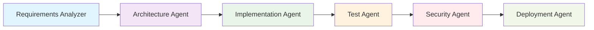
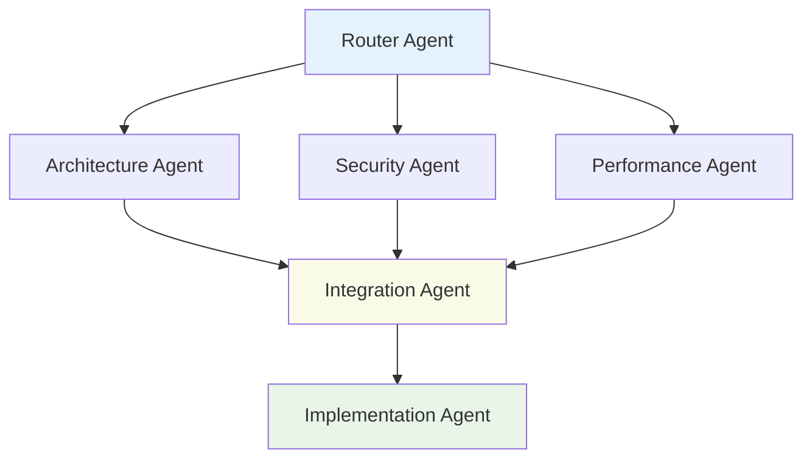
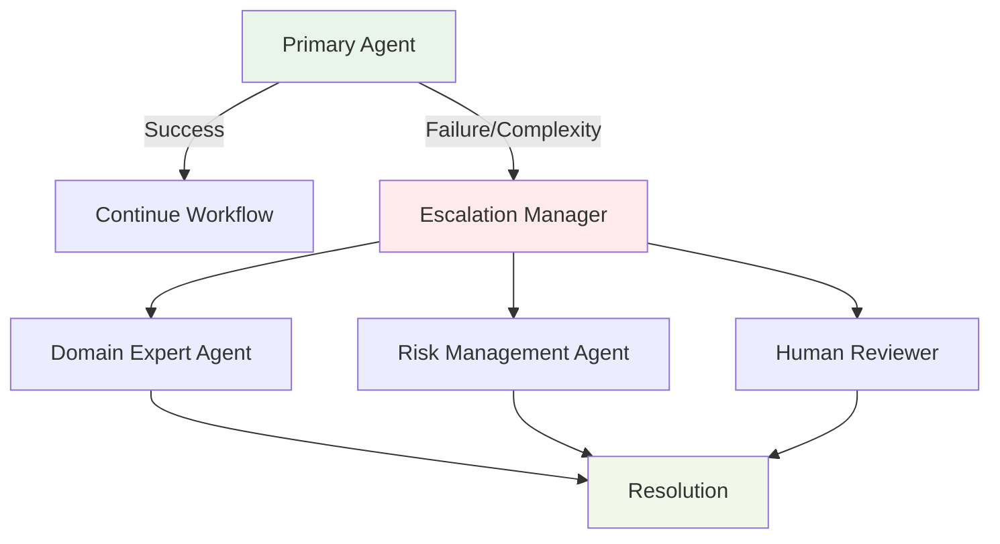

# Agent Workflows and Interdependencies

## Overview

This document describes how HUGAI agents collaborate and interact throughout the development lifecycle, including their interdependencies, communication patterns, and workflow orchestration.

## Core Workflow Patterns

### 1. Sequential Handoff Pattern

Agents pass artifacts through a structured sequence with clear handoff points and quality gates.



**Key Characteristics:**
- Clear input/output specifications
- Human checkpoint gates between phases
- Automated validation at each step
- Rollback capabilities for quality failures

### 2. Parallel Collaboration Pattern

Multiple agents work simultaneously on different aspects of the same artifact.



**Use Cases:**
- System design reviews
- Multi-aspect code analysis
- Risk assessment activities
- Quality assurance processes

### 3. Escalation Pattern

Automated escalation through agent hierarchy based on complexity or failure conditions.



## Agent Dependencies Matrix

### Core Agents Dependencies

| Agent | Depends On | Provides To | Human Checkpoints |
|-------|------------|-------------|-------------------|
| **Router Agent** | - | All agents | Task prioritization |
| **Requirements Analyzer** | Router | Architecture, Domain Expert | Requirements approval |
| **Architecture Agent** | Requirements, Domain Expert | Implementation, Security | Design review |
| **Implementation Agent** | Architecture, Test | Documentation, Security | Code review |
| **Test Agent** | Implementation | Security, Deployment | Test strategy |
| **Security Agent** | Implementation, Test | Deployment | Security review |
| **Deployment Agent** | Security, DevOps | Maintenance | Deployment approval |

### Specialized Agents Dependencies

| Agent | Primary Dependencies | Secondary Dependencies | Escalation Path |
|-------|---------------------|----------------------|-----------------|
| **Domain Expert** | Requirements, Architecture | All domain-specific contexts | Human expert consultation |
| **Performance Agent** | Implementation, Test | Observability, Monitoring | Performance team |
| **Compliance Agent** | Security, Documentation | Risk Management | Legal/Compliance team |
| **Risk Management** | All agents | Escalation Manager | Senior management |
| **Escalation Manager** | All agents | Human stakeholders | Executive leadership |

## Communication Protocols

### 1. Artifact Handoff Protocol

```yaml
handoff_structure:
  metadata:
    source_agent: "agent-name"
    target_agent: "agent-name"
    timestamp: "ISO-8601"
    correlation_id: "unique-id"
    
  payload:
    primary_artifact: "main deliverable"
    supporting_artifacts: ["list of supporting items"]
    context: "relevant background information"
    
  validation:
    quality_gates_passed: ["list of passed gates"]
    known_issues: ["list of identified issues"]
    confidence_score: "0.0-1.0"
    
  next_steps:
    recommended_actions: ["suggested next steps"]
    alternative_paths: ["fallback options"]
    human_review_required: boolean
```

### 2. Collaboration Request Protocol

```yaml
collaboration_request:
  requester: "initiating-agent"
  collaborators: ["list of target agents"]
  collaboration_type: "parallel|sequential|review"
  
  context:
    shared_artifacts: ["artifacts to share"]
    individual_tasks: ["agent-specific tasks"]
    synchronization_points: ["coordination checkpoints"]
    
  success_criteria:
    completion_conditions: ["requirements for success"]
    quality_thresholds: ["minimum quality levels"]
    time_constraints: ["timing requirements"]
```

### 3. Escalation Request Protocol

```yaml
escalation_request:
  triggering_agent: "agent-name"
  escalation_reason: "complexity|failure|risk|timeout"
  severity_level: "low|medium|high|critical"
  
  context:
    original_task: "task description"
    attempted_solutions: ["previous attempts"]
  difficulty_factors: ["complexity indicators"]
    potential_impacts: ["risk assessment"]
    
  escalation_path:
    preferred_agents: ["suggested escalation targets"]
    human_review_required: boolean
    executive_notification: boolean
```

## Workflow Orchestration

### Router Agent Orchestration

The Router Agent serves as the central orchestrator, managing workflow state and directing tasks:

```python
class WorkflowOrchestration:
    def route_task(self, task):
        # Analyze task complexity and requirements
        complexity = self.analyze_complexity(task)
        dependencies = self.identify_dependencies(task)
        
        # Determine optimal agent assignment
        if complexity == "simple":
            return self.assign_single_agent(task)
        elif complexity == "moderate":
            return self.assign_sequential_workflow(task)
        else:
            return self.assign_collaborative_workflow(task)
    
    def manage_workflow_state(self, workflow_id):
        # Track progress across multiple agents
        # Handle failures and recovery
        # Coordinate human checkpoints
        # Manage escalations
```

### Quality Gate Coordination

Quality gates ensure consistency and completeness at workflow transition points:

```yaml
quality_gates:
  requirements_approval:
    triggers: ["requirements-analyzer completion"]
    validators: ["domain-expert", "human-reviewer"]
    criteria: ["completeness", "clarity", "feasibility"]
    
  architecture_review:
    triggers: ["architecture-agent completion"]
    validators: ["security-agent", "performance-agent", "human-architect"]
    criteria: ["scalability", "security", "maintainability"]
    
  implementation_review:
    triggers: ["implementation-agent completion"]
    validators: ["test-agent", "security-agent", "human-reviewer"]
    criteria: ["code-quality", "test-coverage", "security-compliance"]
```

## Failure Handling and Recovery

### Automatic Recovery Patterns

1. **Retry with Context Enhancement**
   - Agent failures trigger automatic retry with additional context
   - Maximum 3 retry attempts with exponential backoff
   - Context enrichment from related agents

2. **Alternative Agent Assignment**
   - If primary agent fails, Router assigns backup agent
   - Fallback chain: Primary → Secondary → Domain Expert → Human

3. **Workflow Rollback**
   - Critical failures trigger rollback to last stable state
   - Artifacts marked for re-processing
   - Human notification for manual intervention

### Human Intervention Triggers

```yaml
human_intervention_required:
  automatic_triggers:
    - "agent_failure_threshold_exceeded"
    - "quality_gate_failure_multiple_times"
    - "security_vulnerability_detected"
    - "compliance_violation_identified"
    
  manual_triggers:
    - "stakeholder_escalation_request"
    - "external_dependency_blocked"
    - "business_priority_change"
    - "risk_tolerance_exceeded"
```

## Performance Optimization

### Parallel Execution Optimization

- **Non-blocking workflows**: Independent agents run in parallel
- **Resource allocation**: Dynamic scaling based on workload
- **Load balancing**: Task distribution across available agents
- **Cache utilization**: Shared context and artifact caching

### Workflow Metrics

```yaml
performance_metrics:
  efficiency_metrics:
    - "average_task_completion_time"
    - "agent_utilization_rate"
    - "human_checkpoint_duration"
    - "escalation_frequency"
    
  quality_metrics:
    - "defect_escape_rate"
    - "rework_percentage"
    - "stakeholder_satisfaction"
    - "compliance_adherence"
    
  collaboration_metrics:
    - "agent_handoff_success_rate"
    - "communication_latency"
    - "context_preservation_quality"
    - "workflow_completion_rate"
```

## Best Practices

### 1. Workflow Design

- **Clear interfaces**: Well-defined inputs/outputs for each agent
- **Idempotent operations**: Agents can safely retry operations
- **State preservation**: Workflow state persisted at checkpoints
- **Graceful degradation**: Fallback options for agent failures

### 2. Agent Collaboration

- **Context sharing**: Rich context passed between agents
- **Explicit dependencies**: Clear dependency declarations
- **Quality contracts**: Defined quality expectations
- **Feedback loops**: Continuous improvement through metrics

### 3. Human Integration

- **Strategic checkpoints**: Human review at critical decision points
- **Escalation clarity**: Clear escalation paths and criteria
- **Override capabilities**: Human ability to override agent decisions
- **Audit trails**: Complete traceability of decisions and actions

## Troubleshooting Common Issues

### Agent Communication Failures

**Symptoms**: Workflow stalls, missing artifacts, timeout errors
**Solutions**:
- Check agent availability and health status
- Verify network connectivity and API endpoints
- Review artifact serialization/deserialization
- Examine correlation ID consistency

### Quality Gate Failures

**Symptoms**: Repeated quality gate rejections, workflow loops
**Solutions**:
- Review quality criteria configuration
- Check agent output quality and completeness
- Verify validator agent functionality
- Escalate to human review if appropriate

### Performance Bottlenecks

**Symptoms**: Slow workflow execution, resource contention
**Solutions**:
- Analyze agent resource utilization
- Optimize parallel execution opportunities
- Review caching and artifact reuse
- Consider agent scaling or load balancing

---

This workflow documentation provides the foundation for understanding and optimizing agent collaboration within the HUGAI methodology, ensuring efficient and effective AI-assisted development processes.