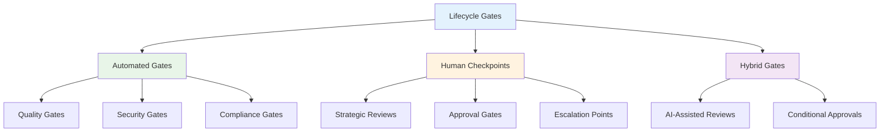

# Lifecycle Gates and Checkpoints

## Overview

HUGAI methodology implements a comprehensive system of lifecycle gates and checkpoints that ensure quality, compliance, and governance throughout the AI development process. This document details the structure, implementation, and management of these critical control points.

## Gate Architecture

### Gate Classification System



### Gate Hierarchy and Flow

```yaml
gate_hierarchy:
  phase_gates:
    - name: "Requirements Gate"
      type: "human_checkpoint"
      position: "planning-requirements → design-architecture"
      mandatory: true
      
    - name: "Architecture Gate"
      type: "hybrid"
      position: "design-architecture → implementation"
      mandatory: true
      
    - name: "Implementation Gate"
      type: "automated"
      position: "implementation → testing-qa"
      mandatory: true
      
    - name: "Security Gate"
      type: "automated"
      position: "testing-qa → deployment"
      mandatory: true
      
    - name: "Deployment Gate"
      type: "human_checkpoint"
      position: "deployment → maintenance"
      mandatory: true
      
  continuous_gates:
    - name: "Code Quality Gate"
      type: "automated"
      frequency: "every_commit"
      scope: "all_phases"
      
    - name: "Compliance Gate"
      type: "automated"
      frequency: "daily"
      scope: "all_phases"
      
    - name: "Risk Assessment Gate"
      type: "hybrid"
      frequency: "weekly"
      scope: "implementation_onwards"
```

## Automated Gates

### 1. Quality Gates

Automated quality checks that validate artifacts against predefined criteria.

```yaml
quality_gates:
  code_quality:
    criteria:
      - metric: "test_coverage"
        threshold: ">= 80%"
        blocking: true
      - metric: "code_complexity"
        threshold: "<= 10 (cyclomatic)"
        blocking: true
      - metric: "duplication"
        threshold: "<= 3%"
        blocking: false
        
    tools:
      - "SonarQube"
      - "CodeClimate"
      - "ESLint/Pylint"
      
    actions:
      pass: "continue_to_next_phase"
      fail: "block_progression_notify_team"
      
  architecture_quality:
    criteria:
      - metric: "component_coupling"
        threshold: "<= acceptable_threshold"
        blocking: true
      - metric: "documentation_completeness"
        threshold: ">= 90%"
        blocking: true
      - metric: "api_consistency"
        threshold: "100%"
        blocking: true
        
    validation_methods:
      - "static_analysis"
      - "architecture_compliance_checks"
      - "dependency_analysis"
```

### 2. Security Gates

Automated security validation throughout the development lifecycle.

```yaml
security_gates:
  vulnerability_scanning:
    scope: "code_dependencies_infrastructure"
    frequency: "every_build"
    tools:
      - "Snyk"
      - "OWASP Dependency Check"
      - "Aqua Security"
      
    severity_thresholds:
      critical: 0  # No critical vulnerabilities allowed
      high: 2      # Maximum 2 high-severity issues
      medium: 10   # Maximum 10 medium-severity issues
      
  security_testing:
    types:
      - "SAST" # Static Application Security Testing
      - "DAST" # Dynamic Application Security Testing  
      - "IAST" # Interactive Application Security Testing
      
    required_coverage:
      - "authentication_mechanisms"
      - "authorization_controls"
      - "data_encryption"
      - "input_validation"
      
  compliance_checks:
    frameworks:
      - "OWASP Top 10"
      - "NIST Cybersecurity Framework"
      - "SOC 2 Type II"
      - "ISO 27001"
      
    automated_checks:
      - "data_classification_compliance"
      - "access_control_validation"
      - "audit_trail_completeness"
      - "encryption_standard_compliance"
```

### 3. Performance Gates

Automated performance validation and optimization checks.

```yaml
performance_gates:
  load_testing:
    thresholds:
      - metric: "response_time_p95"
        threshold: "<= 200ms"
        test_scenario: "normal_load"
      - metric: "throughput"
        threshold: ">= 1000 rps"
        test_scenario: "peak_load"
      - metric: "error_rate"
        threshold: "<= 0.1%"
        test_scenario: "stress_test"
        
  resource_efficiency:
    criteria:
      - metric: "memory_usage"
        threshold: "<= 80% of allocated"
        environment: "production"
      - metric: "cpu_utilization"
        threshold: "<= 70% average"
        environment: "production"
      - metric: "storage_growth"
        threshold: "<= 10% monthly"
        environment: "production"
```

## Human Checkpoints

### 1. Strategic Review Points

Critical decision points requiring human judgment and stakeholder alignment.

```yaml
strategic_checkpoints:
  requirements_approval:
    participants:
      - "product_owner"
      - "technical_lead"
      - "domain_expert"
      - "stakeholder_representative"
      
    deliverables:
      - "requirements_specification"
      - "acceptance_criteria"
      - "risk_assessment"
      - "resource_estimation"
      
    approval_criteria:
      - "business_value_validated"
      - "technical_feasibility_confirmed"
      - "risk_tolerance_acceptable"
      - "resource_availability_verified"
      
    decision_options:
      - "approve_and_proceed"
      - "approve_with_conditions"
      - "request_modifications"
      - "reject_and_terminate"
      
  architecture_review:
    participants:
      - "solution_architect"
      - "security_architect"
      - "platform_engineer"
      - "technical_lead"
      
    focus_areas:
      - "scalability_and_performance"
      - "security_and_compliance"
      - "maintainability_and_operability"
      - "cost_and_resource_efficiency"
      
    deliverables:
      - "architecture_decision_records"
      - "system_design_documents"
      - "security_architecture_review"
      - "operational_readiness_assessment"
```

### 2. Quality Assurance Reviews

Human validation of quality aspects that require expert judgment.

```yaml
quality_checkpoints:
  code_review:
    reviewers:
      - "senior_developer" # mandatory
      - "domain_expert"    # conditional
      - "security_specialist" # for security-critical code
      
    review_criteria:
      - "code_correctness_and_logic"
      - "adherence_to_standards"
      - "security_considerations"
      - "performance_implications"
      - "maintainability_aspects"
      
    review_outcomes:
      - "approved"
      - "approved_with_minor_changes"
      - "requires_major_revisions"
      - "rejected"
      
  user_acceptance_testing:
    participants:
      - "end_users"
      - "business_analysts"
      - "qa_specialists"
      
    test_scenarios:
      - "happy_path_workflows"
      - "edge_case_handling"
      - "error_recovery_procedures"
      - "performance_under_load"
      
    acceptance_criteria:
      - "functional_requirements_met"
      - "usability_standards_achieved"
      - "performance_targets_reached"
      - "security_requirements_satisfied"
```

## Hybrid Gates

### AI-Assisted Reviews

Combination of automated analysis and human oversight for complex evaluations.

```yaml
hybrid_gates:
  ai_assisted_architecture_review:
    ai_components:
      - analysis: "dependency_impact_assessment"
        tool: "architecture_analysis_agent"
        confidence_threshold: 0.85
        
      - analysis: "security_pattern_validation"
        tool: "security_analysis_agent"
        confidence_threshold: 0.90
        
      - analysis: "performance_bottleneck_prediction"
        tool: "performance_analysis_agent"
        confidence_threshold: 0.80
        
    human_review_triggers:
      - "ai_confidence_below_threshold"
      - "conflicting_recommendations"
      - "novel_architecture_patterns"
      - "high_risk_components_identified"
      
    escalation_criteria:
      - "multiple_ai_agents_disagree"
      - "human_reviewer_requests_escalation"
      - "external_dependency_risks_identified"
      
  intelligent_code_review:
    ai_analysis:
      - "code_smell_detection"
      - "potential_bug_identification"
      - "security_vulnerability_scanning"
      - "performance_optimization_suggestions"
      
    human_focus_areas:
      - "business_logic_correctness"
      - "architectural_consistency"
      - "code_readability_and_maintainability"
      - "domain_specific_validation"
```

## Gate Configuration and Management

### Gate Definition Schema

```yaml
gate_definition:
  metadata:
    name: "gate_name"
    version: "1.0.0"
    type: "automated|human|hybrid"
    phase: "lifecycle_phase"
    mandatory: boolean
    
  criteria:
    - name: "criterion_name"
      type: "metric|binary|threshold"
      value: "expected_value_or_threshold"
      blocking: boolean
      weight: "relative_importance_0_to_1"
      
  participants:
    required: ["list_of_required_roles"]
    optional: ["list_of_optional_roles"]
    escalation: ["escalation_chain"]
    
  tools:
    - name: "tool_name"
      configuration: "tool_specific_config"
      integration: "api_webhook_manual"
      
  actions:
    on_pass: "next_action"
    on_fail: "failure_action"
    on_timeout: "timeout_action"
    
  notifications:
    channels: ["email", "slack", "dashboard"]
    templates: "notification_templates"
    escalation_schedule: "timing_for_escalations"
```

### Gate Orchestration

```python
class GateOrchestrator:
    def execute_gate(self, gate_config, context):
        """Execute a gate based on its configuration"""
        
        # Initialize gate execution
        execution = self.initialize_execution(gate_config, context)
        
        # Execute based on gate type
        if gate_config.type == "automated":
            result = self.execute_automated_gate(gate_config, context)
        elif gate_config.type == "human":
            result = self.execute_human_checkpoint(gate_config, context)
        elif gate_config.type == "hybrid":
            result = self.execute_hybrid_gate(gate_config, context)
            
        # Process results and trigger actions
        return self.process_gate_result(result, gate_config)
        
    def handle_gate_failure(self, gate_config, failure_reason):
        """Handle gate failure scenarios"""
        
        # Determine failure response
        if gate_config.blocking:
            self.block_progression(gate_config, failure_reason)
        else:
            self.log_warning_and_continue(gate_config, failure_reason)
            
        # Trigger notifications
        self.send_notifications(gate_config, failure_reason)
        
        # Escalate if necessary
        if self.should_escalate(gate_config, failure_reason):
            self.escalate_issue(gate_config, failure_reason)
```

## Monitoring and Analytics

### Gate Performance Metrics

```yaml
gate_metrics:
  efficiency_metrics:
    - "average_gate_execution_time"
    - "gate_pass_rate_by_type"
    - "false_positive_rate"
    - "false_negative_rate"
    
  quality_metrics:
    - "defects_escaped_past_gates"
    - "rework_required_after_gate_passage"
    - "stakeholder_satisfaction_with_gates"
    
  process_metrics:
    - "gate_bottleneck_identification"
    - "human_checkpoint_duration"
    - "escalation_frequency"
    - "gate_bypass_requests"
```

### Gate Analytics Dashboard

```yaml
dashboard_components:
  real_time_status:
    - "active_gates_by_phase"
    - "pending_human_approvals"
    - "blocked_workflows"
    - "escalated_issues"
    
  historical_analysis:
    - "gate_performance_trends"
    - "quality_improvement_tracking"
    - "process_efficiency_evolution"
    - "cost_benefit_analysis"
    
  predictive_insights:
    - "potential_bottleneck_prediction"
    - "quality_risk_forecasting"
    - "resource_requirement_planning"
    - "optimization_opportunities"
```

## Best Practices and Guidelines

### Gate Design Principles

1. **Fail Fast**: Detect issues as early as possible in the lifecycle
2. **Clear Criteria**: Unambiguous pass/fail criteria for all gates
3. **Proportional Response**: Gate rigor proportional to risk and impact
4. **Continuous Improvement**: Regular review and optimization of gates
5. **Human-Centric**: Human oversight for strategic and complex decisions

### Implementation Guidelines

```yaml
implementation_best_practices:
  gate_configuration:
    - "start_with_minimal_viable_gates"
    - "add_complexity_gradually"
    - "validate_gate_effectiveness_regularly"
    - "maintain_clear_documentation"
    
  human_checkpoint_optimization:
    - "provide_clear_context_and_information"
    - "minimize_time_to_decision"
    - "enable_parallel_reviews_where_possible"
    - "implement_effective_escalation_paths"
    
  automation_strategy:
    - "automate_repetitive_validations_first"
    - "maintain_human_override_capabilities"
    - "implement_comprehensive_logging"
    - "provide_clear_failure_diagnostics"
```

### Common Pitfalls to Avoid

1. **Over-Gating**: Too many gates slowing down development
2. **Under-Gating**: Insufficient quality control leading to issues
3. **Inconsistent Criteria**: Variable standards across similar gates
4. **Poor Communication**: Unclear expectations for gate participants
5. **Lack of Flexibility**: Rigid gates that don't adapt to context

---

This lifecycle gates documentation provides comprehensive guidance for implementing and managing quality, security, and governance controls throughout the HUGAI development process, ensuring systematic risk mitigation while maintaining development velocity.