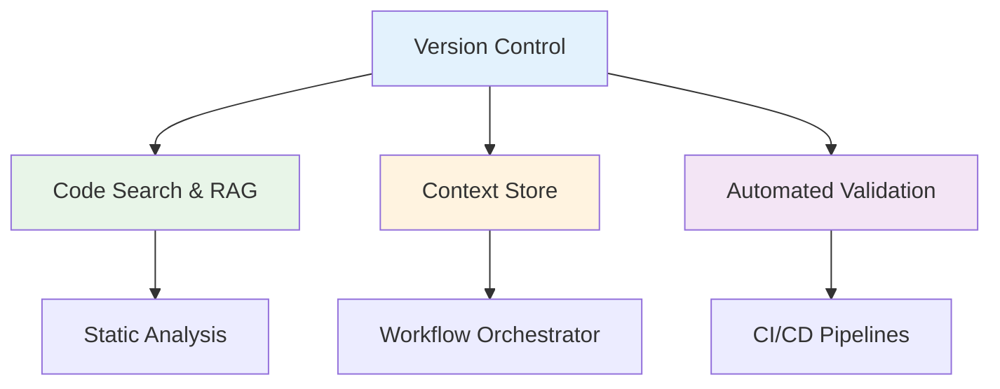
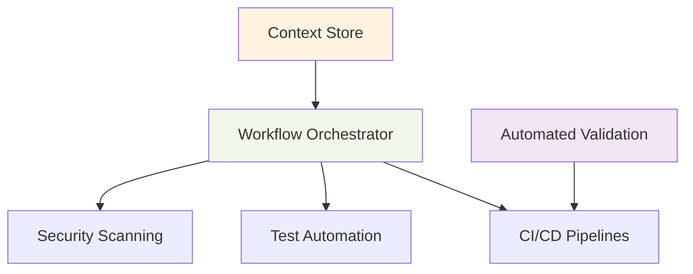
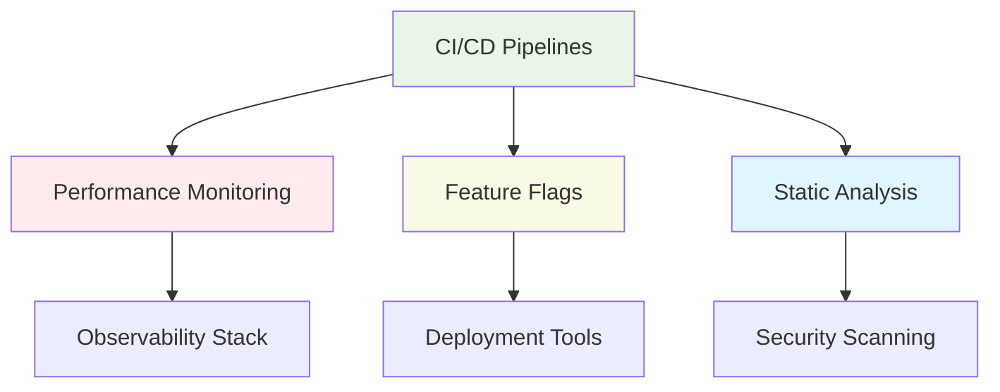

# Tool Dependencies and Integration

## Overview

This document outlines the dependencies and integration patterns between HUGAI tools, providing guidance for system architects and implementers on how tools interact, share data, and coordinate operations within the development ecosystem.

## Tool Dependency Hierarchy

### Foundation Layer (Tier 1)

Base infrastructure tools that provide core capabilities for all other tools.



**Core Dependencies:**
- **Version Control**: Foundation for all code-related operations
- **Context Store**: Central state management and artifact storage
- **Code Search & RAG**: Semantic search and knowledge retrieval
- **Automated Validation**: Quality gates and compliance checking

### Platform Layer (Tier 2)

Integration and orchestration tools that coordinate between foundation tools and specialized services.



**Integration Capabilities:**
- **Workflow Orchestrator**: Central coordination of all tool interactions
- **CI/CD Pipelines**: Automated deployment and integration workflows
- **Test Automation**: Comprehensive testing across all layers
- **Security Scanning**: Security validation throughout the pipeline

### Specialized Layer (Tier 3)

Domain-specific tools that provide specialized capabilities for particular aspects of development.



## Tool Integration Matrix

### Direct Dependencies

| Tool | Hard Dependencies | Soft Dependencies | Optional Integrations |
|------|-------------------|-------------------|----------------------|
| **Version Control** | - | Context Store | Workflow Orchestrator |
| **Code Search & RAG** | Version Control | Context Store | Static Analysis |
| **Context Store** | - | Version Control | All tools |
| **Workflow Orchestrator** | Context Store | All tools | External APIs |
| **CI/CD Pipelines** | Version Control, Automated Validation | Workflow Orchestrator | Deployment Tools |
| **Test Automation** | Version Control | CI/CD Pipelines | Performance Monitoring |
| **Static Analysis** | Version Control | Code Search & RAG | Security Scanning |
| **Security Scanning** | Version Control | Static Analysis | Compliance Systems |
| **Performance Monitoring** | Deployment Tools | Observability Stack | Alert Systems |
| **Observability Stack** | Deployment Tools | Performance Monitoring | Logging Systems |
| **Feature Flags** | Deployment Tools | Context Store | Analytics Tools |
| **Deployment Tools** | Version Control, CI/CD | Containerization | Cloud Platforms |
| **Containerization** | Version Control | Deployment Tools | Orchestration Platforms |
| **Automated Validation** | Version Control | All tools | Compliance Systems |

### Data Flow Dependencies

```yaml
data_flows:
  code_artifacts:
    source: "Version Control"
    consumers: 
      - "Code Search & RAG"
      - "Static Analysis" 
      - "CI/CD Pipelines"
      - "Test Automation"
    
  build_artifacts:
    source: "CI/CD Pipelines"
    consumers:
      - "Test Automation"
      - "Security Scanning"
      - "Deployment Tools"
      - "Performance Monitoring"
    
  test_results:
    source: "Test Automation"
    consumers:
      - "CI/CD Pipelines"
      - "Workflow Orchestrator"
      - "Context Store"
    
  security_reports:
    source: "Security Scanning"
    consumers:
      - "CI/CD Pipelines"
      - "Automated Validation"
      - "Risk Management Systems"
    
  performance_metrics:
    source: "Performance Monitoring"
    consumers:
      - "Observability Stack"
      - "Context Store"
      - "Alert Systems"
```

## Integration Patterns

### 1. Event-Driven Integration

Tools communicate through events and message queues for loose coupling.

```yaml
event_patterns:
  version_control_events:
    - event: "code_committed"
      triggers: ["CI/CD Pipeline", "Code Search Index Update"]
      payload: ["commit_hash", "changed_files", "author", "timestamp"]
    
    - event: "branch_created"
      triggers: ["Workflow Orchestrator", "Feature Flag System"]
      payload: ["branch_name", "base_branch", "author"]
    
    - event: "pull_request_opened"
      triggers: ["Automated Validation", "Security Scanning"]
      payload: ["pr_id", "changes", "target_branch"]
  
  build_events:
    - event: "build_completed"
      triggers: ["Test Automation", "Deployment Tools"]
      payload: ["build_id", "artifacts", "status", "metadata"]
    
    - event: "tests_passed"
      triggers: ["Security Scanning", "Deployment Pipeline"]
      payload: ["test_results", "coverage", "performance_metrics"]
```

### 2. API-Based Integration

Synchronous communication for real-time data access and coordination.

```yaml
api_integrations:
  context_store_api:
    endpoints:
      - path: "/artifacts/{type}/{id}"
        method: "GET"
        consumers: ["All tools"]
        purpose: "Retrieve artifacts and metadata"
      
      - path: "/workflows/{id}/state"
        method: "GET/PUT"
        consumers: ["Workflow Orchestrator", "CI/CD"]
        purpose: "Workflow state management"
    
  validation_api:
    endpoints:
      - path: "/validate/{artifact_type}"
        method: "POST"
        consumers: ["All tools"]
        purpose: "Quality gate validation"
      
      - path: "/policies/check"
        method: "POST"
        consumers: ["Security Scanning", "Compliance"]
        purpose: "Policy compliance checking"
```

### 3. Data Pipeline Integration

Batch processing and ETL operations for analytics and reporting.

```yaml
data_pipelines:
  metrics_aggregation:
    sources: 
      - "Performance Monitoring"
      - "Test Automation"
      - "CI/CD Pipelines"
    destinations:
      - "Observability Stack"
      - "Analytics Platform"
    frequency: "real-time streaming"
    
  security_intelligence:
    sources:
      - "Security Scanning"
      - "Static Analysis"
      - "Automated Validation"
    destinations:
      - "Security Information Systems"
      - "Risk Management Platform"
    frequency: "continuous with alerts"
```

## Configuration Management

### Centralized Configuration

```yaml
config_management:
  central_config_store:
    location: "config/tools/"
    format: "YAML with JSON Schema validation"
    versioning: "Git-based with semantic versioning"
    
  configuration_hierarchy:
    - global_defaults: "config/global.yaml"
    - environment_overrides: "config/environments/{env}.yaml"
    - tool_specific: "config/tools/{tool}.yaml"
    - local_overrides: "config/local.yaml"
    
  secret_management:
    provider: "HashiCorp Vault / AWS Secrets Manager"
    rotation: "automated with 90-day cycle"
    access_control: "role-based with least privilege"
```

### Tool-Specific Configuration

```yaml
tool_configurations:
  version_control:
    repositories:
      primary: "git@github.com:org/main-repo.git"
      mirrors: ["backup locations"]
    branching_strategy: "GitFlow with feature branches"
    hooks: ["pre-commit validation", "post-commit triggers"]
    
  ci_cd_pipelines:
    platforms: ["GitHub Actions", "Jenkins", "GitLab CI"]
    environments: ["dev", "staging", "prod"]
    deployment_strategies: ["blue-green", "canary", "rolling"]
    
  observability_stack:
    metrics: "Prometheus + Grafana"
    logging: "ELK Stack (Elasticsearch, Logstash, Kibana)"
    tracing: "Jaeger / OpenTelemetry"
    alerting: "PagerDuty / Slack integration"
```

## Health Monitoring and Diagnostics

### Tool Health Checks

```yaml
health_monitoring:
  system_health:
    checks:
      - name: "version_control_connectivity"
        endpoint: "/health"
        frequency: "30 seconds"
        timeout: "5 seconds"
        
      - name: "context_store_availability"
        endpoint: "/api/health"
        frequency: "30 seconds"
        dependencies: ["database", "cache"]
        
      - name: "workflow_orchestrator_status"
        endpoint: "/status"
        frequency: "60 seconds"
        metrics: ["active_workflows", "queue_depth"]
    
  dependency_monitoring:
    - tool: "CI/CD Pipelines"
      monitors: ["Version Control", "Automated Validation"]
      failure_actions: ["retry", "fallback", "alert"]
      
    - tool: "Security Scanning"
      monitors: ["Static Analysis", "Version Control"]
      failure_actions: ["queue_for_retry", "escalate"]
```

### Performance Metrics

```yaml
performance_monitoring:
  tool_metrics:
    version_control:
      - "commit_processing_time"
      - "repository_size_growth"
      - "concurrent_operations"
      
    ci_cd_pipelines:
      - "build_duration"
      - "deployment_frequency"
      - "failure_rate"
      - "recovery_time"
      
    test_automation:
      - "test_execution_time"
      - "test_flakiness_rate"
      - "coverage_trends"
      
  integration_metrics:
    - "cross_tool_latency"
    - "data_consistency_rates"
    - "event_processing_delays"
    - "api_response_times"
```

## Troubleshooting and Maintenance

### Common Integration Issues

#### 1. Authentication and Authorization

**Problem**: Tools unable to authenticate with each other
**Solutions**:
- Verify API keys and certificates
- Check service account permissions
- Validate token expiration and renewal
- Review network security policies

#### 2. Data Synchronization Issues

**Problem**: Inconsistent data across tools
**Solutions**:
- Implement eventual consistency patterns
- Add data validation checkpoints
- Use transaction-like operations where possible
- Monitor data drift and implement reconciliation

#### 3. Performance Bottlenecks

**Problem**: Slow tool interactions affecting workflows
**Solutions**:
- Implement caching layers
- Optimize API calls and batch operations
- Use asynchronous processing where appropriate
- Monitor and tune database performance

### Maintenance Procedures

```yaml
maintenance_tasks:
  daily:
    - "health_check_verification"
    - "log_analysis_and_cleanup"
    - "performance_metrics_review"
    
  weekly:
    - "dependency_update_checks"
    - "security_vulnerability_scans"
    - "backup_verification"
    - "capacity_planning_review"
    
  monthly:
    - "tool_version_updates"
    - "configuration_audit"
    - "disaster_recovery_testing"
    - "integration_performance_tuning"
```

## Migration and Upgrade Strategies

### Tool Replacement Strategy

```yaml
migration_approach:
  phases:
    1. "parallel_deployment"
       - Deploy new tool alongside existing
       - Implement dual-write patterns
       - Validate functionality parity
       
    2. "gradual_cutover"
       - Route percentage of traffic to new tool
       - Monitor performance and functionality
       - Rollback capability maintained
       
    3. "full_migration"
       - Complete traffic cutover
       - Decommission old tool
       - Update all dependent configurations
    
  rollback_procedures:
    - Automated rollback triggers
    - Data synchronization verification
    - Dependency chain updates
    - Stakeholder notification protocols
```

### Version Compatibility Matrix

| Tool | Version | Compatible With | Breaking Changes |
|------|---------|-----------------|------------------|
| Version Control | 2.40+ | All current tools | API authentication changes |
| Context Store | 3.2+ | Workflow Orchestrator 2.1+ | Schema migration required |
| CI/CD Pipelines | 1.8+ | All tools except Legacy Static Analysis | New webhook format |
| Security Scanning | 4.1+ | Static Analysis 2.0+ | New report format |

---

This tool dependency documentation provides comprehensive guidance for understanding, implementing, and maintaining tool integrations within the HUGAI development ecosystem, ensuring robust and scalable infrastructure for AI-assisted development.