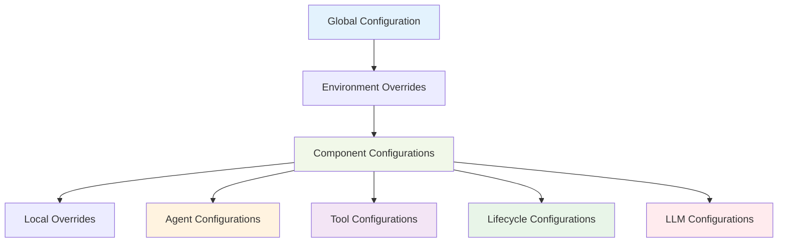

# HUGAI Configuration Reference

## Overview

This comprehensive reference guide documents all HUGAI configuration options, schemas, and settings. Use this as the authoritative source for understanding configuration parameters, validation rules, and integration requirements.

## Configuration Architecture

### Configuration Hierarchy



### Configuration Sources Priority

1. **Local Overrides** (`config/local.yaml`) - Highest priority
2. **Environment Variables** - Override configuration values
3. **Component Configurations** (`config/{type}/{name}.yaml`) 
4. **Environment Defaults** (`config/environments/{env}.yaml`)
5. **Global Defaults** (`config/global.yaml`) - Lowest priority

## Global Configuration

### File: `config/global.yaml`

```yaml
# Global HUGAI system configuration
hugai:
  version: "1.0.0"
  environment: "${HUGAI_ENVIRONMENT:-development}"
  
  # System-wide settings
  system:
    timezone: "UTC"
    log_level: "${LOG_LEVEL:-info}"
    debug_mode: false
    feature_flags:
      enable_experimental_features: false
      enable_advanced_analytics: true
      
  # Default networking configuration
  networking:
    timeout_default: 30 # seconds
    retry_attempts: 3
    backoff_strategy: "exponential"
    
  # Security defaults
  security:
    encryption_at_rest: true
    encryption_in_transit: true
    audit_logging: true
    session_timeout: 3600 # seconds
    
  # Performance settings
  performance:
    max_concurrent_operations: 10
    memory_limit: "2GB"
    cpu_limit: "2.0"
    
  # Data retention policies
  data_retention:
    logs: "30_days"
    metrics: "90_days"
    audit_trails: "1_year"
    temporary_files: "24_hours"
```

## Agent Configuration Schema

### Schema: `config/schemas/agent-schema.json`

#### Core Structure

```yaml
# Agent configuration template with all available options
metadata:
  name: string                    # REQUIRED: kebab-case identifier
  version: string                 # REQUIRED: semantic version (x.y.z)
  description: string             # REQUIRED: brief description
  category: enum                  # REQUIRED: agent category
  author: string                  # REQUIRED: author/team
  created: string                 # REQUIRED: ISO date (YYYY-MM-DD)
  updated: string                 # REQUIRED: ISO date (YYYY-MM-DD)
  tags: array[string]            # OPTIONAL: classification tags
  
  # Enhanced metadata
  documentation:
    primary_doc: string           # Path to main documentation
    related_docs: array[string]   # Related documentation links
    config_dependencies: array[string] # Dependent configurations
    
  maintainer: string              # Current maintainer contact
  status: enum                    # active, deprecated, experimental
  review_date: string             # Next review date
  changelog_url: string           # Change history location

configuration:
  # Role definition
  role:
    primary: string               # REQUIRED: Main responsibility
    secondary: array[string]      # Additional responsibilities
    
  # Capabilities
  capabilities: array[string]     # REQUIRED: What agent can do
  
  # Dependencies
  dependencies:
    agents: array[string]         # Required agent dependencies
    tools: array[string]          # Required tool dependencies
    services: array[string]       # Required service dependencies
    
    # Cross-reference documentation (auto-generated)
    agent_docs: array[object]     # Links to agent docs
    tool_docs: array[object]      # Links to tool docs
    
  # Parameters
  parameters:
    llm_config:
      model: string               # Primary LLM model
      temperature: number         # 0.0 - 2.0, creativity level
      max_tokens: integer         # Maximum response tokens
      system_prompt: string       # System-level prompt
      
    execution:
      timeout: integer            # Execution timeout (seconds)
      retry_attempts: integer     # Number of retry attempts
      parallel_execution: boolean # Allow parallel execution
      
    custom: object               # Agent-specific parameters

integration:
  # Trigger conditions
  triggers: array[object]         # When agent activates
    - event: string              # Event name
      condition: string          # Activation condition
      priority: enum             # urgent, high, medium, low
      
  # Input specifications
  inputs: array[object]           # Expected inputs
    - name: string               # Input name
      type: string               # Data type
      format: string             # Data format
      validation: string         # Validation rules
      source: string             # Input source
      
  # Output specifications  
  outputs: array[object]          # Produced outputs
    - name: string               # Output name
      type: string               # Data type
      format: string             # Data format
      schema: string             # Output schema
      consumers: array[string]    # Output consumers
      
  # Tool integrations
  tool_integrations: object       # Tool-specific configs
    
validation:
  # Quality gates
  quality_gates: array[object]    # REQUIRED: Quality checkpoints
    - name: string               # Gate name
      type: enum                 # automated, human, hybrid
      criteria: string           # Pass/fail criteria
      threshold: string          # Threshold value
      blocking: boolean          # Blocks progression
      weight: number             # Relative importance
      
  # Metrics
  metrics: array[object]          # Performance metrics
    - name: string               # Metric name
      type: enum                 # counter, gauge, histogram
      target: string             # Target value
      alert_threshold: string    # Alert trigger
      
  # Human checkpoints
  human_checkpoints: object       # Human review points
    
examples: object                  # Usage examples and scenarios

cli_usage: string                 # CLI command examples
```

#### Agent Categories

| Category | Description | Examples |
|----------|-------------|----------|
| `core-agents` | Essential system agents | router, requirements-analyzer |
| `specialized-agents` | Domain-specific agents | security, performance, domain-expert |
| `utility-agents` | Support and utility functions | prompt-refiner, retry, documentation |
| `governance-agents` | Oversight and compliance | compliance, risk-management, escalation |

#### LLM Configuration Options

```yaml
# Comprehensive LLM configuration
parameters:
  llm_config:
    # Model selection
    model: string                 # Primary model (e.g., "gpt-4-turbo")
    fallback_models: array[string] # Fallback model chain
    
    # Generation parameters
    temperature: 0.0-2.0          # Creativity/randomness
    top_p: 0.0-1.0               # Nucleus sampling
    top_k: integer               # Top-k sampling
    max_tokens: integer          # Maximum response length
    
    # Behavioral controls
    system_prompt: string        # System instructions
    few_shot_examples: array     # Example interactions
    stop_sequences: array[string] # Generation stop conditions
    
    # Performance optimization
    streaming: boolean           # Enable response streaming
    caching: boolean            # Enable response caching
    batch_requests: boolean     # Allow request batching
    
    # Cost management
    max_cost_per_request: number # Maximum cost per request
    cost_optimization: enum      # aggressive, balanced, quality_first
    
    # Monitoring
    log_requests: boolean        # Log all requests
    track_usage: boolean         # Track token usage
    quality_monitoring: boolean  # Monitor response quality
```

## Tool Configuration Schema

### Schema: `config/schemas/tool-schema.json`

#### Core Structure

```yaml
metadata:
  name: string                    # REQUIRED: Tool identifier
  version: string                 # REQUIRED: Tool version
  description: string             # REQUIRED: Tool description
  category: enum                  # Tool category
  vendor: string                  # Tool vendor/provider
  license: string                 # License type
  
  author: string                  # Configuration author
  created: string                 # Creation date
  updated: string                 # Last update date
  
  documentation:
    primary_doc: string           # Main documentation
    vendor_docs: string           # Vendor documentation
    integration_guide: string     # Integration guide
    
  maintainer: string              # Current maintainer
  status: enum                    # active, deprecated, experimental

configuration:
  # Tool type and deployment
  tool_type: enum                 # Tool classification
  deployment_model: enum          # saas, on_premise, hybrid
  
  # Capabilities
  capabilities: object            # Tool capabilities
    primary: array[string]        # Primary capabilities
    secondary: array[string]      # Secondary capabilities
    integrations: array[string]   # Integration types
    
  # Supported technologies
  supported_languages: array[string] # Programming languages
  supported_platforms: array[string] # Operating systems
  supported_formats: array[string]   # Data formats
  
  # Connection configuration
  connection:
    base_url: string              # Service base URL
    api_version: string           # API version
    timeout: integer              # Connection timeout
    retry_attempts: integer       # Retry attempts
    
  # Authentication
  authentication:
    type: enum                    # auth type
    oauth_endpoint: string        # OAuth endpoint
    client_id: string             # Client ID
    client_secret: string         # Client secret (env var)
    api_key: string               # API key (env var)
    token_refresh_threshold: integer # Refresh threshold
    
  # Rate limiting
  rate_limiting:
    requests_per_hour: integer    # Hourly rate limit
    requests_per_minute: integer  # Minute rate limit
    concurrent_requests: integer  # Concurrent limit
    backoff_strategy: enum        # Backoff strategy
    respect_server_limits: boolean # Respect server limits

integration:
  # API endpoints
  api_endpoints: object           # API endpoint definitions
  
  # Webhook endpoints
  webhook_endpoints: object       # Webhook configurations
  
  # Triggers
  triggers: array[object]         # Integration triggers
  
  # Data processing
  data_processing: object         # Data transformation rules

validation:
  # Health checks
  health_checks: array[object]    # REQUIRED: Health monitoring
    - name: string               # Check name
      endpoint: string           # Health endpoint
      frequency: string          # Check frequency
      timeout: string            # Check timeout
      success_criteria: string   # Success criteria
      
  # Performance metrics
  performance_metrics: array[object] # Performance monitoring
  
  # Quality gates
  quality_gates: array[object]   # Quality validation

examples: object                  # Usage examples

cli_usage: string                 # CLI usage examples
```

#### Tool Categories

| Category | Description | Examples |
|----------|-------------|----------|
| `development-tools` | Development support | version-control, code-search |
| `security-tools` | Security and compliance | security-scanning, vulnerability-assessment |
| `testing-tools` | Testing and QA | test-automation, performance-testing |
| `deployment-tools` | Deployment and operations | ci-cd, containerization, deployment |
| `monitoring-tools` | Observability and monitoring | observability-stack, performance-monitoring |
| `collaboration-tools` | Team collaboration | context-store, workflow-orchestrator |

## Lifecycle Configuration Schema

### Schema: `config/schemas/lifecycle-schema.json`

#### Core Structure

```yaml
metadata:
  name: string                    # REQUIRED: Phase identifier
  version: string                 # REQUIRED: Version
  description: string             # REQUIRED: Phase description
  category: enum                  # Phase category
  
  author: string                  # Configuration author
  created: string                 # Creation date
  updated: string                 # Last update date
  
  documentation:
    primary_doc: string           # Main documentation
    methodology_link: string      # Methodology reference
    best_practices: string        # Best practices guide
    
  maintainer: string              # Current maintainer
  status: enum                    # active, deprecated, experimental

configuration:
  # Phase definition
  phase_type: enum                # core, governance, custom
  position: string                # Phase position in lifecycle
  duration: string                # Expected duration
  
  # Phase objectives
  objectives: array[string]       # Phase objectives
  
  # Activities
  activities: object              # Phase activities
    
  # Prerequisites
  prerequisites: array[string]    # Required preconditions
  
  # Deliverables
  deliverables: array[object]     # Expected deliverables
    - name: string               # Deliverable name
      type: string               # Deliverable type
      format: string             # Format specification
      validation: string         # Validation criteria
      
  # Dependencies
  dependencies:
    predecessor_phases: array[string] # Required predecessor phases
    concurrent_phases: array[string]  # Concurrent phases
    agent_dependencies: array[string] # Required agents
    tool_dependencies: array[string]  # Required tools

integration:
  # Triggers
  triggers: array[object]         # Phase activation triggers
  
  # Inputs
  inputs: array[object]           # Expected inputs
  
  # Outputs
  outputs: array[object]          # Produced outputs
  
  # Handoff procedures
  handoff_procedures: object      # Phase transition procedures

validation:
  # Checkpoints
  checkpoints: array[object]      # REQUIRED: Validation checkpoints
    - name: string               # Checkpoint name
      type: enum                 # automated, human, hybrid
      trigger: string            # Trigger condition
      criteria: array[string]    # Validation criteria
      approvers: array[string]   # Required approvers
      
  # Quality gates
  quality_gates: array[object]   # Quality validation gates
  
  # Metrics
  metrics: array[object]          # Phase metrics

examples: object                  # Usage examples

cli_usage: string                 # CLI usage examples
```

#### Lifecycle Categories

| Category | Description | Examples |
|----------|-------------|----------|
| `core-phases` | Essential development phases | planning, design, implementation |
| `governance-phases` | Oversight and control | checkpoints, automated-gates |
| `specialized-phases` | Domain-specific phases | security-review, compliance-validation |
| `custom-phases` | Organization-specific | ai-ethics-review, custom-approval |

## LLM Configuration Schema

### Schema: `config/schemas/llm-schema.json`

#### Core Structure

```yaml
metadata:
  name: string                    # REQUIRED: Configuration name
  version: string                 # REQUIRED: Version
  description: string             # REQUIRED: Description
  category: "llm-models"          # Fixed category
  
  author: string                  # Configuration author
  created: string                 # Creation date
  updated: string                 # Last update date
  
  documentation:
    primary_doc: string           # Main documentation
    provider_docs: object         # Provider documentation links
    
  maintainer: string              # Current maintainer
  status: enum                    # active, deprecated, experimental

configuration:
  # Model philosophy
  model_philosophy: object        # Model selection principles
  
  # Model providers
  model_providers: object         # Provider configurations
    openai:
      enabled: boolean
      provider_name: string
      base_url: string
      api_key: string             # Environment variable
      organization: string        # Environment variable
      
      rate_limits:
        requests_per_minute: integer
        tokens_per_minute: integer
        requests_per_day: integer
        
      retry_configuration:
        max_retries: integer
        backoff_factor: number
        initial_delay: integer
        max_delay: integer
        
      models: object              # Model definitions
        
    anthropic:
      # Similar structure for other providers
      
  # Intelligent routing
  routing_strategy: object        # Model selection strategy
  
  # Cost management
  cost_controls: object           # Budget and cost controls
  
  # Performance monitoring
  performance_monitoring: object  # Monitoring configuration

integration:
  # Model selection API
  model_selection: object         # Selection API configuration
  
  # Fallback mechanisms
  fallback_configuration: object # Fallback strategies
  
  # Monitoring integration
  monitoring_integration: object # Monitoring system integration

validation:
  # Monitoring
  monitoring: object              # REQUIRED: Performance monitoring
    
  # Quality gates
  quality_gates: array[object]   # Quality validation
  
  # Performance metrics
  performance_metrics: array[object] # Performance tracking

examples: object                  # Usage examples

cli_usage: string                 # CLI usage examples
```

## Environment Configuration

### Development Environment

```yaml
# config/environments/development.yaml
environment:
  name: "development"
  debug_mode: true
  log_level: "debug"
  
hugai:
  # Relaxed settings for development
  timeouts:
    agent_execution: 600        # Extended timeouts
    tool_integration: 300
    
  rate_limits:
    relaxed_mode: true
    
  monitoring:
    detailed_logging: true
    performance_profiling: true
    
  # Development-specific features
  features:
    hot_reload: true
    debug_endpoints: true
    test_mode: true
    
  # Mock configurations
  mocks:
    external_services: true
    llm_providers: false        # Use real LLMs even in dev
    
llm_providers:
  # Development LLM settings
  openai:
    model_overrides:
      default_model: "gpt-3.5-turbo"  # Cheaper for development
      
  cost_limits:
    daily_budget: "$50"
    monthly_budget: "$500"
```

### Staging Environment

```yaml
# config/environments/staging.yaml
environment:
  name: "staging"
  debug_mode: false
  log_level: "info"
  
hugai:
  # Production-like settings
  timeouts:
    agent_execution: 300
    tool_integration: 120
    
  rate_limits:
    standard_mode: true
    
  monitoring:
    comprehensive_monitoring: true
    alerts_enabled: true
    
  # Staging-specific features
  features:
    canary_testing: true
    load_testing: true
    
llm_providers:
  # Staging LLM settings
  openai:
    model_overrides:
      default_model: "gpt-4"
      
  cost_limits:
    daily_budget: "$200"
    monthly_budget: "$2000"
```

### Production Environment

```yaml
# config/environments/production.yaml
environment:
  name: "production"
  debug_mode: false
  log_level: "warn"
  
hugai:
  # Production-optimized settings
  timeouts:
    agent_execution: 180
    tool_integration: 60
    
  rate_limits:
    strict_mode: true
    
  monitoring:
    comprehensive_monitoring: true
    alerts_enabled: true
    uptime_monitoring: true
    
  # Production features
  features:
    auto_scaling: true
    disaster_recovery: true
    
  # Security hardening
  security:
    enhanced_audit_logging: true
    strict_authentication: true
    network_isolation: true
    
llm_providers:
  # Production LLM settings
  openai:
    model_overrides:
      default_model: "gpt-4-turbo"
      
  cost_limits:
    daily_budget: "$1000"
    monthly_budget: "$10000"
    
  # Production monitoring
  monitoring:
    cost_alerts: true
    performance_alerts: true
    quality_monitoring: true
```

## Configuration Validation

### Validation Rules

#### Required Fields

```yaml
# All configurations must have these fields
required_fields:
  metadata:
    - name
    - version
    - description
    - category
    - author
    - created
    - updated
    
  configuration:
    # Type-specific requirements
    
  validation:
    # Type-specific validation requirements
```

#### Field Validation Rules

```yaml
validation_rules:
  metadata:
    name:
      pattern: "^[a-z0-9-]+$"      # kebab-case only
      max_length: 50
      
    version:
      pattern: "^\\d+\\.\\d+\\.\\d+$" # semantic versioning
      
    description:
      min_length: 10
      max_length: 200
      
    category:
      enum: # Category-specific enums
      
    created:
      format: "date"               # YYYY-MM-DD
      
    updated:
      format: "date"               # YYYY-MM-DD
      
  configuration:
    timeout:
      type: "integer"
      minimum: 1
      maximum: 3600
      
    temperature:
      type: "number"
      minimum: 0.0
      maximum: 2.0
      
    max_tokens:
      type: "integer"
      minimum: 1
      maximum: 128000
```

### Configuration Testing

#### Validation Commands

```bash
# Validate single configuration
hugai config validate --file config/agents/router-agent.yaml

# Validate all configurations
hugai config validate --all

# Validate with specific schema
hugai config validate --file config.yaml --schema custom-schema.json

# Check configuration syntax only
hugai config syntax-check --file config.yaml

# Test configuration in dry-run mode
hugai config test --file config.yaml --dry-run
```

#### Automated Validation

```yaml
# Continuous validation configuration
validation_automation:
  pre_commit_hooks:
    - "configuration_syntax_check"
    - "schema_validation"
    - "security_scan"
    
  ci_cd_integration:
    - "full_configuration_validation"
    - "integration_testing"
    - "performance_testing"
    
  scheduled_validation:
    frequency: "daily"
    checks:
      - "configuration_drift_detection"
      - "dependency_validation"
      - "security_compliance_check"
```

## Configuration Best Practices

### Naming Conventions

```yaml
naming_conventions:
  configuration_files:
    format: "kebab-case.yaml"
    examples:
      - "router-agent.yaml"
      - "security-scanner.yaml"
      - "planning-requirements.yaml"
      
  configuration_keys:
    format: "snake_case"
    examples:
      - "max_tokens"
      - "retry_attempts"
      - "system_prompt"
      
  environment_variables:
    format: "UPPER_SNAKE_CASE"
    prefix: "HUGAI_"
    examples:
      - "HUGAI_OPENAI_API_KEY"
      - "HUGAI_LOG_LEVEL"
      - "HUGAI_ENVIRONMENT"
```

### Security Best Practices

```yaml
security_practices:
  secrets_management:
    - "never_commit_secrets_to_git"
    - "use_environment_variables"
    - "use_secrets_management_systems"
    - "rotate_secrets_regularly"
    
  access_control:
    - "implement_role_based_access"
    - "use_least_privilege_principle"
    - "audit_configuration_access"
    - "implement_approval_workflows"
    
  encryption:
    - "encrypt_sensitive_configurations"
    - "use_tls_for_all_communications"
    - "implement_at_rest_encryption"
    - "validate_certificate_chains"
```

### Performance Optimization

```yaml
performance_optimization:
  configuration_loading:
    - "cache_frequently_accessed_configs"
    - "lazy_load_large_configurations"
    - "use_configuration_validation_cache"
    - "implement_configuration_hot_reload"
    
  resource_management:
    - "set_appropriate_timeouts"
    - "configure_connection_pooling"
    - "implement_circuit_breakers"
    - "monitor_resource_utilization"
    
  cost_optimization:
    - "set_budget_limits"
    - "use_cost_effective_models"
    - "implement_request_caching"
    - "monitor_usage_patterns"
```

## Configuration Migration

### Version Migration

```yaml
# Migration configuration
migration:
  version_compatibility:
    supported_versions: ["1.0.0", "1.1.0", "1.2.0"]
    migration_path:
      "1.0.0_to_1.1.0":
        changes:
          - "add_new_metadata_fields"
          - "update_schema_references"
        automation: "automatic"
        
      "1.1.0_to_1.2.0":
        changes:
          - "restructure_validation_section"
          - "add_performance_monitoring"
        automation: "assisted"
        
  migration_tools:
    - "hugai config migrate --from 1.0.0 --to 1.1.0"
    - "hugai config validate-migration --preview"
    - "hugai config backup --before-migration"
```

### Backup and Recovery

```yaml
backup_strategy:
  automatic_backups:
    frequency: "before_each_change"
    retention: "30_days"
    location: "backups/configurations/"
    
  manual_backups:
    command: "hugai config backup --all"
    format: "compressed_archive"
    metadata: "backup_manifest.json"
    
  recovery_procedures:
    point_in_time_recovery: "hugai config restore --timestamp"
    selective_recovery: "hugai config restore --files"
    validation_after_recovery: "automatic"
```

---

This configuration reference provides comprehensive documentation for all HUGAI configuration options, schemas, and best practices. Use it as the authoritative guide for understanding and implementing HUGAI configurations in your environment.